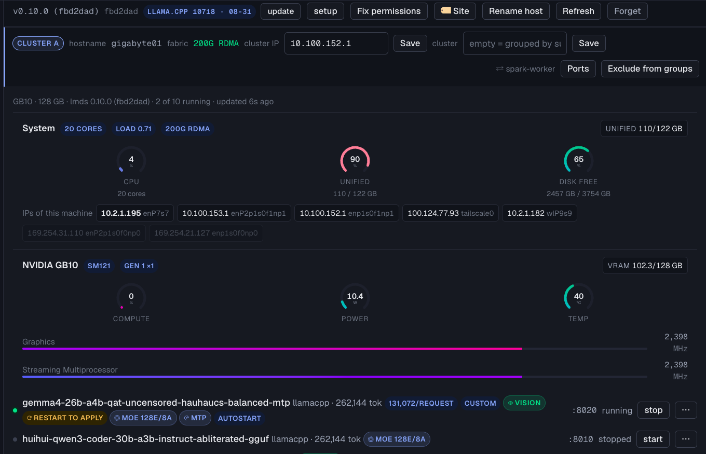

<div align="center">

# LMDS · Local Model Deploy Studio

**From a Hugging Face link to a server that actually answers — on your own machine**

Deploy language models to **NVIDIA DGX Spark** and **Ubuntu + RTX**, one machine or
several acting as one. Nothing leaves the machine except what you ask for.

[](CHANGELOG.md)
[](tests/)
[](docs/INSTALL.md)
[](docs/INSTALL.md)
[](pyproject.toml)
[](LICENSE)
[](docs/COMMERCIAL.md)

**[Install](docs/INSTALL.md)** · **[Usage](docs/USAGE.md)** · **[Multi-node](docs/RUNBOOK-MULTI-NODE.md)** · **[Security](SECURITY.md)** · **[Ports &amp; network](docs/NETWORK.md)** · **[ภาษาไทย](README.md)**

Built and maintained by **neronain** — [facebook.com/neronain.minidev](https://www.facebook.com/neronain.minidev)

</div>

> 🇹🇭 The Thai [README.md](README.md) and `docs/` are the primary documentation, and the CLI's own
> help text is in Thai. This page mirrors it for English readers. The **web console is bilingual** —
> English by default, Thai from the button in the header.

---

## In 30 seconds

|  |  |
|---|---|
| **What it is** | Give it a Hugging Face link and get an OpenAI-compatible server running on your own hardware, plus a web console that drives every machine in the fleet. |
| **What it fixes** | Commands that look entirely correct and quietly return wrong results — a context cut to a tenth, tool calling that never converts a reply, a 200G link that negotiated down to 50G, a KV cache estimated twenty times too large. |
| **How to start** | `./install.sh -y`, then `lmds web --enable --bind 0.0.0.0`. Every other machine joins from *Add machine* in the console — you never install them one by one. |
| **Price** | **One machine is free, forever**, commercial use included. Two or more machines managed together need a licence. |
| **Your data** | **No telemetry.** Works air-gapped. The console fetches nothing from the internet — not even its fonts. |

<div align="center">


*The Overview page: 16 of 17 machines · 18 GPUs · 1,748 GB VRAM · 47 bundles fleet-wide, 21 running
— a memory bar per machine sorted fullest first, an engine donut, and a **Needs attention** list
computed from real state (here: two machines have several models claiming port 8000, so the stopped
ones cannot start until the port changes). The tile says so itself when one machine has not been
probed yet: a fleet-wide total has to admit when it is still incomplete.*

</div>

## The problem it solves

Getting a model onto your own hardware is rarely hard because you cannot find the command. It is
hard because **commands that look entirely correct return wrong results with no error**. LMDS is
what came back from running all of that for real and turning each symptom into an automatic check.

| | |
|---|---|
| 🧮 **Arithmetic is code, not the LLM** | Memory fit, KV cache, token budgets, link speed. The LLM only researches the model and fills a fixed JSON schema in the Deployment Plan — it **never writes Bash**. |
| 🛡️ **Every bundle passes gates first** | `bash -n`, audit rules, SHA-256 checksums. No pass, no ZIP. |
| 🔌 **Works with no LLM at all** | Rule-based mode uses recipes proven on real machines. Air-gapped is fine. |
| 🤝 **Machines already serving models are not torn down** | `lmds adopt` reads the command a container is really running and writes it back as a controller that reproduces it exactly — no redeploy, no re-downloading weights. |

## Three commands

```bash
git clone https://github.com/neronain/AutoDeployDGXProject && cd AutoDeployDGXProject
./install.sh -y                      # installs missing Docker / NVIDIA toolkit too
lmds web --enable --bind 0.0.0.0     # console at http://<ip>:8600 — survives reboots · prints the token
```

**Other machines in the fleet install themselves.** Click *Add machine* in the console, enter
host / user / sudo password once: the hub installs its SSH key, then **ships its own code over** as
a ~2 MB git bundle via scp — that machine never needs GitHub access. If `install.sh` fails half-way
the previous version is put back, so a machine is never left without `lmds`.

Prefer the CLI: `lmds hardware` (what this machine is) → `lmds deploy Qwen/Qwen3-32B`

<details>
<summary>More examples</summary>

```bash
# check whether it fits, without creating anything
lmds inspect Qwen/Qwen3-32B --target rtx-pro-4000-dual
# is this context sensible? — answers as a context × concurrency table
lmds inspect <repo> --target dgx-spark-stacked --context 262144
# too big for one machine → stacked (worker-first + sync-worker handled for you)
lmds deploy nvidia/DeepSeek-V4-Flash-NVFP4 --target dgx-spark-stacked
# a GGUF repo with several quants, with no tty to pick a number (scripts / hub)
lmds deploy unsloth/gemma-4-26B-A4B-it-GGUF --gguf Q8_K_XL --yes
# embedding / reranker — detected from the repo · force it with --task when the guess is wrong
lmds deploy VesNFF/Qwen3-VL-Embedding-8B-GGUF --task embed
lmds deploy Qwen/Qwen3-Reranker-4B --target dgx-spark-single --no-llm
```

For gated repos (e.g. `meta-llama/Llama-3.3-70B-Instruct`) it asks for an HF token itself — Enter skips.

</details>

---

## Three questions few tools answer

### 1 · "At this context, how many people can use it at once?"

Most tools report the largest context that fits — which is, by definition, the one where a single
conversation fills the KV pool exactly. Set it and the second request queues, with nothing saying so.

```
KV bf16 · 120 KiB per token
  context      KV each     at once
   32,768       3.8 GB        14.1
  131,072        15 GB         3.5
  262,144        30 GB         1.8   ← the value you typed
```
> • Fits, but serves 1.8 conversations at once — one full-length chat takes almost the whole pool
> • Switching the KV cache to fp8 halves it: 30 GB → 15 GB, 1.8 concurrent → 3.5

Shown in the CLI **and in the web console while the number is still being typed**. Handles GQA and
**MLA** (DeepSeek-V2/V3, Kimi K2/K3), which stores one latent instead of a key and a value — one
formula does not fit both families.

### 2 · Several machines, one model

> **Stacked does not mean faster — it means too big for one machine.**
> Anything that fits on one machine runs faster on one machine.

| | Single | Stacked |
|---|---|---|
| Engine | vLLM · llama.cpp · SGLang | **vLLM only** |
| Artifact | safetensors or GGUF | **safetensors only** |
| Task | chat · vision · embedding · rerank | chat · vision |
| Fast link | not needed | **required**, ≥25G (200G RoCE in practice) |
| Machines | 1 | ≤3 direct-cabled · through a switch: no ceiling we can verify |
| What you gain | fastest | **memory / KV / concurrency** — not tokens per second per user |

LMDS detects ConnectX/RDMA itself, says which machines can stack together, writes `cluster.env`,
and **warns when a link negotiated below what the card can do** — NVIDIA validates Spark links at
≥184 Gbit/s, and a port left on auto-negotiate commonly lands at 50G while everything still looks fine.

The fit report gives **per-node numbers** (capacity · OS · engine · NCCL buffer 3 GB/node ·
weights/N · KV/N) · `lmds cluster pair` creates the key **on the head** so the head can ssh into
the worker · `lmds cluster doctor <head> <worker>` walks through every reason a pair is not ready,
with the fix · impossible pairs are rejected at analyze time (422) rather than dying at push.

**Run for real on 2× DGX Spark**: Llama 3.3 70B · `mazinb/Qwen3.8-Flash-Next-Uncensored-NVFP4`
at 173 GB (vLLM TP=2, tool calls working) · `nvidia/NVIDIA-Nemotron-3-Super-120B-A12B-NVFP4`

→ [RUNBOOK-MULTI-NODE.md](docs/RUNBOOK-MULTI-NODE.md) · [FLEET-MULTI-NODE.md](docs/FLEET-MULTI-NODE.md) · [compared with NVIDIA's own docs](docs/NVIDIA-CLUSTER-SOURCES.md)

### 3 · A web console that matches the CLI

Left rail: Overview · This machine · All machines · a **site → machine** tree · Library (fleet
models / scores / recipes / weights / hub settings) · **English ↔ Thai** from the button in the header.

Everything is doable from the console: the deploy wizard · download + verify · start/stop/restart ·
doctor · logs · the test suite (`test-text` `test-vision` `test-reasoning` `test-tools` `test-embed`
`test-rerank` `bench` `stress`) · autostart · stacked commands · repair · remove · **setting,
rotating and removing a model's API key** · **changing a machine's hostname** · an **Update** button
for the whole fleet — **and models on other machines are controlled exactly like local ones**.

<div align="center">



*Click any machine and its detail opens in place — the same CPU / Unified / Disk gauges on every
machine, the GB10 with its Graphics/SM clocks and temperature, every IP the machine actually holds,
the **200G RDMA** fabric and the `CLUSTER A` frame around the pair it can stack with. Values the
card does not report are hidden, not shown as 0. The button row carries **Rename host**, which
changes that machine's OS hostname from here — machines already shipped to a site that turn out to
share a name are usually reachable on port 8600 and nothing else.*

</div>

- **Readable before it is legible** — the same gauges everywhere, with warning colours before things run out
- **Buttons appear only for commands that controller really supports**, read from its own dispatch table
- **Machines are grouped by site**; machines that can stack together share a coloured frame
- **Fetches nothing from the internet** — even the typefaces ship in the package, so it works behind
  a proxy or fully air-gapped

**The assistant** in the bottom-right answers from *this fleet's actual state* rather than general
knowledge, and **goes and looks at the machine before answering** (opens that controller's logs,
checks GPU, disk and ports, or runs `lmds doctor` over SSH), then answers from what came back. It
knows the context/KV rules but is **forbidden from doing the arithmetic**: an LLM multiplying in its
head is wrong in a way that reads as authoritative, which is worse than saying it does not know.

Once the cause is clear enough to propose a fix it **asks you instead of acting** — *do it* /
*step by step* / *hold*. **The LLM cannot issue commands**: it only picks entries from a fixed
catalogue, the shell command is assembled in code, and the approval ticket is minted by the server.
The only way anything runs is a human pressing a button.

#### Scores measured against the real server

<div align="center">


*Measured through the running server's own OpenAI API — decode / prefill / TTFT split across six
workloads, plus seven capabilities probed one at a time (instructions · Thai · JSON · tools ·
reasoning · vision · recall). Here: Qwen3.6-35B-A3B (Q4_K) on 3× RTX 3060 at 65.7–84.4 tok/s with
a 262,144 context — comparable across engines and across machines.* · [BENCH.md](docs/BENCH.md)

</div>

---

## Security by default

| | |
|---|---|
| **The console always requires a token** | Whatever it binds to. `127.0.0.1` used to be left open, which let any other user on the same machine — and any page open in the browser (CSRF / DNS rebinding) — issue commands. `--no-auth` still opens it, but you have to ask for that. |
| **Newly deployed models get an API key at birth** | Kept at `~/.lmds/keys/<slug>` (0600), **outside the bundle folder**, which gets zipped and passed around. The controller reads it at start, so it survives reboots. |
| **A record of who did what** | `lmds audit` — time · IP · command · result. Only state-changing commands and refused requests; never the body, never the query string. |
| **Versions can be pinned** | `export LMDS_REPO_REF=v0.10.0` on the hub → every machine gets that exact tag, not the tip of a branch. |
| **Keys are never on argv** | llama.cpp reads a 0600 file via `--api-key-file` · vLLM gets it through the environment · `lmds key set` reads stdin. |

```bash
lmds key new <slug>      # mint a new key for this model      lmds key show <slug> --reveal
lmds audit --failed      # who was refused — token guessing shows up as a run from one IP
lmds doctor <slug>       # the endpoint check says so if it is still serving open
```

**Both of these are now in the console too** — a **Key** button on each model card (mint · reveal ·
paste an existing one · remove) and a **"Who did what"** panel under *Hub settings*, with a
refused-only filter. They exist because `lmds key` and `lmds audit` were CLI-only while most
customers work entirely through the GUI — and the deploy wizard itself used to print an instruction
to run `lmds key show <slug> --reveal`, a command those people cannot type. Revealing a key is a
separate endpoint from reading its state, so the key does not travel over the network every time
the page polls.

> **Bundles installed earlier are not touched** — they keep serving as before until you run
> `lmds key new` yourself. Handing out keys automatically would break every one of a customer's
> clients at once, right after an update.

Full detail: [SECURITY.md](SECURITY.md)

## One machine, whole fleet

```bash
lmds node add 192.168.10.21 --user ops --install   # password once → installs key + LMDS for you
lmds ps --all                     # every machine's models in one table
lmds fleet check --check          # is every machine level with the hub on all 3 axes (code · controller · runtime)
lmds cluster show                 # who has 200G, and which pairs can stack
lmds cluster pair spark-head spark-worker          # let the head ssh into the worker
lmds scan --all                   # weights already on disk anywhere — no re-downloading
lmds node push spark2 <slug>      # send the bundle you approved to another machine
lmds node clone <slug> --from msi-1 --to msi-2     # copy a model machine-to-machine, no re-download
lmds node rename-host msi-6 spark-7                # change that machine's own OS hostname
```

> **`node clone` — build a spare or spread load without downloading again**
>
> A 90 GB model takes 38 minutes from Hugging Face; the machine next to it in the rack already holds
> the same files. **Measured on the fleet: 412 MB/s, done in 3 min 47 s — more than 10× faster.**
> The files travel directly between the two machines, never through the hub, and the key never
> leaves the hub (minted per run, handed to `ssh-agent` over stdin, always removed afterwards).

Target machines run **no daemon**, need no port beyond 22, and **no root** — membership of the
`docker` group is enough. The password is discarded the moment the key is installed; the registry
has no password field by design.

### Changing a machine's hostname from the console

Machines that shipped to a customer and turned out to **share a hostname** cannot be fixed on site:
the only way in is the **LMDS console on port 8600**, with no SSH for anyone to type `hostnamectl`.
So the **Rename host button on the machine card** is the primary interface here, not an afterthought
on top of the CLI (`lmds node rename-host <name> <hostname>`).

- Writes `hostnamectl set-hostname` **and** the `127.0.1.1` line in `/etc/hosts` **in the same sudo
  command** — doing the first and forgetting the second makes every later `sudo` take seconds and
  print "unable to resolve host"
- Validates against RFC 1123 · keeps a copy of the original files at `/root/lmds-hostname/*.<stamp>`
  on that machine (never deleted) · the sudo password travels **over stdin only** — never argv,
  logs or the registry
- **Refuses rather than doing half the job**: when the hub reaches this machine by the very name
  being changed (afterwards it could not get back in, and there is no SSH to repair it), when a
  **stacked** model is running, or when the new name collides with another machine

> **The registry name and the OS hostname are deliberately different things.** The registry name is
> the label every command and every button uses to address a machine; this command changes only the
> name the *machine* calls itself. It is **not a licence-counting matter** either: the counter already
> binds hostname to the set of IPs on the fast link, so two different machines sharing a name have
> always been counted separately.
>
> `~/.lmds/bench/*.json` and recipe PROFILE.yaml files record the name as of the day they were
> measured, as evidence — **deliberately not rewritten**.

<details>
<summary>All model-management commands</summary>

```bash
lmds ps                  # who is running: name, model, engine, port, ● running / ◐ loading / ○ stopped
lmds list                # every bundle + engine/port/context/features + autostart
lmds smoke <name>        # prove it runs: download → verify → start → test-text → stop
lmds start/stop/restart <name>
lmds logs <name> -f      # -n 500 = tail
lmds enable <name>       # come back after reboot (systemd) · disable = undo
lmds doctor <name>       # why download/start still fails + the command that fixes it
lmds repair <name>       # re-download missing/corrupt files, then re-verify
lmds rebuild <name>      # regenerate the same bundle with the current logic
lmds set <name> --image <digest> --tool-parser qwen3_xml --extra-args "…"
lmds adopt <container> / --port N   # bring a model that was running before LMDS into the system
lmds remove <name>       # delete everything (--keep-weights keeps the weights)
lmds recipes             # controllers proven on real hardware — used when there is no API key
lmds bench run <name>    # measure speed + capabilities and keep the result (see BENCH.md)
lmds burn [--all]        # DGX Spark: is the GPU clock latched by the EC? (below)
lmds watchdog arm <name> # watch with a real generate and restart when it stops answering — opt-in
```

`lmds ps` also shows **containers not deployed through LMDS** (vLLM / llama.cpp / Ollama / TGI
already running) — stop/restart/logs/enable work the same; that group uses `docker stop` and never
removes the container.

</details>

### `lmds burn` — the GPU clock `nvidia-smi` calls healthy, and isn't

The GB10's embedded controller can latch the GPU below 1 GHz while `nvidia-smi` shows nothing wrong
at all (P0 · persistence on · no clock event reason · no power cap · no thermal). **The only symptom
is slowness**, and **a reboot does not clear it**. In a stacked group one affected machine drags the
whole group, because every collective waits for the slowest rank.

`lmds burn` puts a full load on the GPU for 15 seconds and measures — because the values read while
the GPU is idle look the same on a healthy machine and a latched one. It separates three states that
must not be conflated: **low clocks + low power** = really latched, so it prints the **physical
steps** (shut down → unplug the adapter for 30–60 s → plug it back in) because this cannot be fixed
remotely · **low clocks + a clock event reason** = thermal or power, go look at airflow and supply,
not the plug · **normal clocks + low TFLOPS** = somebody else is using the GPU, which is not a fault.

`lmds bench run` calls it automatically before every measurement and **stores the result alongside
the numbers**, so you can tell later whether that run was clocked properly (skip with `--skip-burn`).
Machines that are not GB10, or have no NVIDIA GPU, answer "not applicable" rather than "failed".
Check another machine with `--node <name>` or the whole fleet with `--all`: it **ships a shell script
rather than calling `lmds` on the node**, so machines that never had LMDS installed, or run an older
version than the hub, can still be checked — and it fetches nothing from the network.

> **Know this before you rely on it** · Measuring needs a torch that can see CUDA on that machine —
> found from an interpreter first, then from an image **already on the machine** (**nothing is
> pulled**; air-gapped sites have to work). That means **a machine running only llama.cpp usually
> cannot be measured**, because it never needed a vLLM image. Measured across our own 16-machine
> fleet (2026-09-21): exactly one machine had torch with CUDA installed natively, most of the rest
> were measurable only by borrowing a vLLM image, and **three could not be measured at all**.
> Those answer "cannot tell" rather than "failed", with the fix: copy an image from a neighbour with
> `docker save` → `docker load` (no internet needed), or point at one yourself with
> `LMDS_BURN_PYTHON` / `LMDS_BURN_IMAGE`.

### `lmds watchdog` — `/health` can be green while a rank is stuck

`/health` can answer 200 while the forward pass is not moving. The only thing that proves it still
moves is **asking for a generation and getting tokens back**. The watchdog generates a real **2
tokens** every 120 seconds and restarts the model after several consecutive misses — not one, since
GC pauses and network hiccups are real.

**It is opt-in, one model at a time; nothing arms itself.** LMDS is meant to manage machines that
were already serving a customer's models, and something that can restart those on its own is a
bigger deal than leaving one hung until a person notices. Hence:

- **Refused at arm time**: containers LMDS did not create (`lmds adopt`), anything with no registry
  entry, and embedding/rerank models — asking them to generate is meaningless, and the result would
  be a restart because *we* asked the wrong question
- **A cap on restarts per window, then it gives up permanently** — still probing, still reporting,
  but no longer restarting. A model that cannot start being restarted every 2 minutes all night is
  damage the watchdog created itself. There is **backoff** between attempts and a **settle period**
  after each restart (big models take ten minutes to load)
- **4xx is not dead** — 404/401 means it is answering; that is reported as `misconfigured` so a
  person fixes the probe instead of restarting a customer's model
- Every restart lands in `lmds audit` with its reason — "the system did it" has to be findable in
  the same place as commands issued by people. It uses a **systemd user service** when there is one;
  machines in LXC/Docker without a full init system work too (it prints `lmds watchdog run <name>`
  to put under any process supervisor)

## Recipes — learn once, reuse across the fleet

A machine with no LLM API key deploys rule-based, which only knows "GGUF → llama.cpp"; it does not
know per-model facts (the parser, the image with the right kernels, the mmproj file), so a deploy
can succeed and the server still fail to start. **Recipes** close that gap: controllers that
**ran on real hardware** live in a central Git repository.

```bash
lmds recipes --sync                                      # pull the latest recipes instead of guessing
lmds recipes --publish <name> --features tools,vision    # send one you tested for review
```

Two tiers: **canonical** ([`dgx-spark-all-controllers`](https://github.com/neronain/dgx-spark-all-controllers)),
curated and pulled by every machine, and **candidates** ([`script-update`](https://github.com/neronain/script-update)),
freshly published and awaiting review. The publish target is set in config — **empty means a local
store**, which is the safe default for customers: their fleet shares with itself and never touches
our repositories.

> Only **model values** travel (engine, image, parser, mmproj). **Machine values** (port, context,
> slots) stay in `bundle.env` and do not follow; the receiving machine re-fits them to itself.

## What is supported

| | ARM64 / unified (Spark) | x86_64 / discrete (RTX) |
|---|---|---|
| **llama.cpp** | ✅ native build (`start` builds it itself) | ✅ docker (+ multimodal) |
| **vLLM** | ✅ docker · ✅ stacked across 2 machines | ✅ docker |
| **SGLang** | ✅ docker (`--engine sglang`) | ✅ docker |

| Task | llama.cpp (GGUF) | vLLM (safetensors) | stacked |
|---|---|---|---|
| chat / tool calling / reasoning | ✅ (`--jinja`) | ✅ (`--tool-parser` `--reasoning-parser`) | ✅ |
| vision | ✅ mmproj (+ `--image-min-tokens`) | ✅ | ✅ |
| embedding | ✅ `--embedding --pooling` | ✅ `--runner pooling` | ❌ refused |
| rerank | ✅ `--reranking` | ✅ `--runner pooling --convert classify` | ❌ refused |
| MTP / speculative | ✅ draft head from the repo | via `--extra-args` | via `--extra-args` |

Hardware-validated across all five model families — GGUF, NVFP4, MoE, dense safetensors, gated
repos · **24 target presets** (7 verified on real hardware) · **2,453 tests** on every push across
Python 3.10–3.13

**MoE and MTP are reported as facts read from files**, not guessed by an LLM — total and active
experts per token come from `config.json` or GGUF metadata, because *total tells you how much memory
you need and active tells you how fast it will be*. Repos that ship an MTP draft head are wired up
automatically (measured on DGX Spark: gemma4-26B-A4B at **1.78×** with identical output).

> **Model source: Hugging Face only.** Ollama registry and NVIDIA NGC are phase 2. Hugging Face now
> serves large files through **Xet**: a single stream from Thailand crawls at ~0.3 MB/s, so the
> llama.cpp controller fetches 8 ranges in parallel and reaches ~50 MB/s on its own.

## Updating

```bash
cd ~/AutoDeployDGXProject && git pull && ./install.sh     # the hub first, always — or press Update in the console
lmds node install --all                                  # then the fleet — the hub ships the code, GitHub is never touched
lmds fleet check --check                                 # is every machine really level with the hub (checked live)
```

> ⚠️ **Update the hub first.** `lmds node install --all` ships **the hub's code** to the nodes. With
> an old hub, the whole fleet ends up perfectly level — with the old version.
>
> ⚠️ **`git pull` alone is not enough.** LMDS is installed as a copy into its venv, so the `lmds`
> command keeps running the old code until `./install.sh` runs again. Existing config and keys are
> kept; `install.sh` moves the old venv aside first and puts it back if pip fails.

Sites that must pin a version: `export LMDS_REPO_REF=v0.10.0` on the hub, then `lmds node install` as usual.

## The whole system — four repositories

**[LiteGate · AiGatewayLocal](https://github.com/neronain/AiGatewayLocal)** is the other half: LMDS
*deploys* models onto your machines, while LiteGate is the *single door* in front of all of them —
API keys, quotas, per-person permissions, and measuring what a running server **can actually do**.
**Neither needs the other.** A parser LiteGate reports as missing is a knob LMDS can turn straight
away with `restart --tool-parser`, then prove with `test-tools`, which measures `auto` mode — the
same mode agents actually use.

| Repository | Role |
|---|---|
| **[AutoDeployDGXProject](https://github.com/neronain/AutoDeployDGXProject)** (LMDS) | Fetch weights, analyse, generate controllers, deploy and run models across the fleet over SSH |
| **[AiGatewayLocal](https://github.com/neronain/AiGatewayLocal)** (LiteGate) | One OpenAI/Anthropic endpoint in front of every model, with keys, quotas and permissions |
| **[dgx-spark-all-controllers](https://github.com/neronain/dgx-spark-all-controllers)** (canonical) | Curated, reviewed controllers that every machine pulls |
| **[script-update](https://github.com/neronain/script-update)** (candidates) | Newly published controllers awaiting review before promotion |

LMDS deploys with controllers built from real experiments → proven ones go to candidates for review
→ promoted to canonical → every machine in the fleet syncs them. LiteGate measures what the servers
can really do and sends the fixes back.

## Documentation

| | |
|---|---|
| [INSTALL.md](docs/INSTALL.md) | Step-by-step install — prerequisites, disk, proxy/air-gapped, providers, uninstall |
| [USAGE.md](docs/USAGE.md) | Full guide — deploy, every controller command and env var, fleet, web console, troubleshooting |
| [SECURITY.md](SECURITY.md) | What leaves the machine, where secrets live, auth/audit, reporting a vulnerability |
| [BENCH.md](docs/BENCH.md) | Scoring a running model — speed plus seven capabilities, measured against the real server |
| [PREFLIGHT.md](docs/PREFLIGHT.md) | What is checked before deploying and why — every item from something that really broke |
| [NETWORK.md](docs/NETWORK.md) | Every port and protocol the system uses, and who talks to whom |
| [RUNBOOK-MULTI-NODE.md](docs/RUNBOOK-MULTI-NODE.md) · [FLEET-MULTI-NODE.md](docs/FLEET-MULTI-NODE.md) | The multi-node command sequence as actually run · running many machines from one |
| [DGX-SPARK-VLLM-FIELD-NOTES.md](docs/DGX-SPARK-VLLM-FIELD-NOTES.md) · [HCA-DUAL-TEST.md](docs/HCA-DUAL-TEST.md) | Field notes from real runs — every line carries its own confidence level |
| [GPU-UTIL-RANK-PROTOCOL.md](docs/GPU-UTIL-RANK-PROTOCOL.md) | Protocol for measuring vLLM's off-budget memory against rank count (`scripts/gpu_util_rank_probe.py`) — **written, not yet run, no numbers yet** |
| [NVIDIA-CLUSTER-SOURCES.md](docs/NVIDIA-CLUSTER-SOURCES.md) | NVIDIA's clustering docs — what they confirm, what they add |
| [LICENSING.md](docs/LICENSING.md) | How licensing actually works — how machines are counted, and **what is never locked** |
| [RELEASE.md](docs/RELEASE.md) · [CHANGELOG.md](CHANGELOG.md) · [CONTRIBUTING.md](CONTRIBUTING.md) | Release process · history · dev setup and the rules that must not be broken |
| [PRD.md](docs/PRD.md) · [CLI_SPEC.md](docs/CLI_SPEC.md) · [ROADMAP.md](docs/ROADMAP.md) | Requirements, command spec, roadmap |

## Requirements

- **Ubuntu 22.04 / 24.04 / 25.04** (ARM64 or x86_64) — development works on macOS
- **Python 3.10–3.13** — all four are tested in CI on every push (24.04 ships 3.12 · 25.04 ships 3.13)
- **Docker + NVIDIA Container Toolkit** on target machines (`install.sh` can install both)
- **git + python3** on every node — the hub ships its code as a git bundle; no GitHub access needed
- **Free disk** ≈ *(model size × 1.2) + 25 GB* — the vLLM runtime image alone is 10–20 GB
- **Stacked**: a ≥25G link between the DGX Sparks and head→worker ssh (`lmds cluster pair` sets it up)
- **An LLM provider** (optional): OpenAI / Gemini / MiniMax / OpenAI-compatible — or none, with `--no-llm`

The one thing `install.sh` will not do is install the **NVIDIA driver**: it needs a reboot, and on
some machines a working driver is already present while `ubuntu-drivers install` breaks on dependencies.

## For developers

```bash
python3 -m venv .venv && . .venv/bin/activate && pip install -e '.[dev]' && pytest
ruff check src tests scripts     # the same gate CI runs
```

Rules that must not be broken, and how to add a target preset, provider or quality gate:
[CONTRIBUTING.md](CONTRIBUTING.md)

## License

**One machine is free**, for any purpose including commercial use. **Two or more machines managed
together need a licence.** See [LICENSE](LICENSE) · [commercial terms](docs/COMMERCIAL.md) ·
[third-party notices](THIRD-PARTY-LICENSES).

The source is readable but this is not open source — no forking, redistribution or resale.
**Bundles you generate are yours** — use, modify and pass them on freely. Third-party models, images
and runtimes remain under their own licences.

<div align="center">
<br>

Controller standard inherited from [dgx-spark-all-controllers v3.0.0](https://github.com/neronain/dgx-spark-all-controllers)

**neronain** · [facebook.com/neronain.minidev](https://www.facebook.com/neronain.minidev)

</div>
