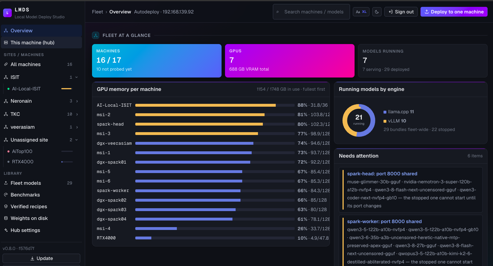
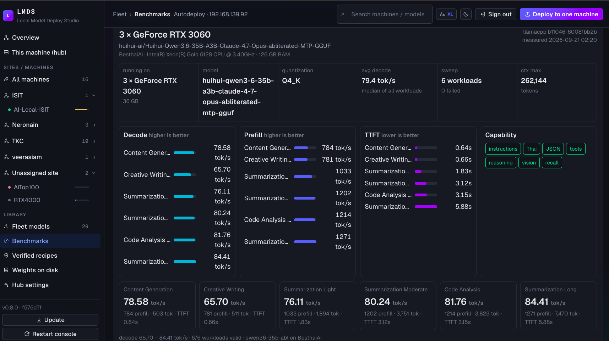

<div align="center">

# LMDS · Local Model Deploy Studio

**จากลิงก์ Hugging Face → เซิร์ฟเวอร์ที่ยิงได้จริงบนเครื่องของคุณเอง**

ระบบวางโมเดลภาษาลงเครื่องตัวเอง สำหรับ **NVIDIA DGX Spark** และ **Ubuntu + RTX**
เครื่องเดียวหรือหลายเครื่องรวมเป็นโมเดลเดียวก็ได้ · ไม่มีอะไรออกนอกเครื่องนอกจากที่คุณสั่ง

[](CHANGELOG.md)
[](tests/)
[](docs/INSTALL.md)
[](docs/INSTALL.md)
[](pyproject.toml)
[](LICENSE)

**[ติดตั้ง](docs/INSTALL.md)** · **[คู่มือใช้งาน](docs/USAGE.md)** · **[หลายเครื่อง](docs/RUNBOOK-MULTI-NODE.md)** · **[สิ่งที่ตรวจให้ก่อน deploy](docs/PREFLIGHT.md)** · **[พอร์ต &amp; เครือข่าย](docs/NETWORK.md)** · **[English](README.en.md)**

สร้างและดูแลโดย **neronain** — [facebook.com/neronain.minidev](https://www.facebook.com/neronain.minidev)

</div>

---

## หน้าตาระบบ

<div align="center">



*ทุกเครื่องในฟลีตหน้าเดียว — GPU, RAM, อุณหภูมิ, จำนวนโมเดลที่รันอยู่ · เครื่องที่ไม่มี GPU
รู้ตัวว่าเป็น control plane และไม่ยอมโหลด weight ลงมา*



*คะแนนที่ยิงผ่าน OpenAI API ของเซิร์ฟเวอร์จริง — decode tok/s, TTFT, context ที่ตั้งได้จริง
และความสามารถ 7 ข้อที่ทดสอบทีละข้อ · เทียบข้าม engine และข้ามเครื่องได้*

</div>

## ปัญหาที่มันแก้

การเอาโมเดลลงเครื่องตัวเองไม่ได้ยากตรง "รันคำสั่งไหน" — มันยากตรงที่**คำสั่งที่ดูถูกทุกอย่าง
กลับให้ผลผิดโดยไม่มี error** ให้เห็น: context ถูกตัดเงียบ ๆ เหลือหนึ่งในสิบ, tool calling ที่
เปิดไว้แต่ไม่เคยแปลงคำตอบจริง, สายเชื่อม 200G ที่ negotiate ลงมาเหลือ 50G, KV cache ที่คำนวณ
เกินจริงยี่สิบเท่าจนตั้ง context ได้แค่เศษเดียวของที่เครื่องรับไหว

LMDS เกิดจากการไล่รันของจริงแล้วเก็บทุกอาการพวกนี้กลับมาเป็นการตรวจอัตโนมัติ

| | |
|---|---|
| 🧮 **คำนวณด้วยโค้ด ไม่ใช่ LLM** | memory fit, KV cache, token budget, ความเร็วลิงก์ — LLM มีหน้าที่แค่วิจัยโมเดลและเลือกค่าใน Deployment Plan ที่เป็น JSON schema ตายตัว **ไม่เคยเขียน Bash เอง** |
| 🛡️ **ทุก bundle ผ่านด่านก่อนถึงมือคุณ** | `bash -n`, audit rules, SHA-256 checksums — ไม่ผ่านคือไม่มี ZIP |
| 🔍 **บอกตอนที่ยังแก้ทัน** | ไม่ใช่ตอนที่ผู้ใช้มาบ่นว่าช้า · ทุกข้อที่ตรวจมาจากของที่พังจริงบนเครื่องจริง |
| 🔌 **ทำงานได้โดยไม่มี LLM** | โหมด rule-based ใช้สูตรที่รันผ่านจริงมาแล้ว · air-gapped ก็ใช้ได้ |
| 🤝 **เครื่องที่มีโมเดลรันอยู่ก่อนแล้ว ไม่ต้องรื้อ** | `lmds adopt` อ่านคำสั่งที่มันรันอยู่จริง (container หรือ process ตรง ๆ) แล้วเขียนเป็น controller ที่รันซ้ำได้เป๊ะ — ไม่ต้อง redeploy ไม่ต้องโหลด weight ใหม่ |

## เริ่มใน 3 คำสั่ง

```bash
git clone https://github.com/neronain/AutoDeployDGXProject && cd AutoDeployDGXProject
./install.sh -y                      # ลง Docker / NVIDIA toolkit ที่ขาดให้ด้วย (ไม่ใส่ -y = ถามก่อนทุกขั้นที่ใช้ sudo)
lmds web --enable --bind 0.0.0.0     # คอนโซลที่ http://<ip>:8600 — ขึ้นเองหลังรีบูต · พิมพ์ token ให้
```

**เครื่องอื่นในฟลีตไม่ต้องติดตั้งเอง** — บนหน้าเว็บกด *Add machine* ใส่ host / user / รหัสผ่าน sudo
ครั้งเดียว: hub ใส่ SSH key ให้, **ส่งโค้ดของตัวเองไปติดตั้ง** (git bundle ~2 MB ผ่าน scp — ไม่ต้อง clone repo
หรือมี deploy key บนเครื่องนั้น, เครื่องนั้นไม่ต้องเข้าถึง GitHub เลย), ตั้ง Docker / NVIDIA toolkit ให้
แล้วเครื่องนั้นโผล่ในเมนูซ้ายทันที · `install.sh` ล้มกลางทาง (PyPI ช้า) = รุ่นเดิมยังอยู่ ไม่ทิ้งเครื่องไว้แบบไม่มี `lmds`

ถนัด CLI มากกว่า: `lmds hardware` (เครื่องนี้คือ target อะไร) → `lmds deploy Qwen/Qwen3-32B`
(วิเคราะห์ → วางแผน → ให้ยืนยัน → bundle + ZIP ที่ผ่านทุกด่าน)

<details>
<summary>ตัวอย่างเพิ่มเติม</summary>

```bash
# ดูก่อนว่าลงได้ไหม โดยยังไม่สร้างอะไร
lmds inspect Qwen/Qwen3-32B --target rtx-pro-4000-dual

# context ที่จะตั้งนี้ ควรไหม — ตอบเป็นตาราง context x จำนวนคนพร้อมกัน
lmds inspect <repo> --target dgx-spark-stacked --context 262144

# โมเดล gated → ถาม HF token ให้เอง (Enter ข้ามได้)
lmds deploy meta-llama/Llama-3.3-70B-Instruct --target dgx-spark-single

# ใหญ่เกินหนึ่งเครื่อง → stacked (worker-first + sync-worker ให้อัตโนมัติ)
lmds deploy nvidia/DeepSeek-V4-Flash-NVFP4 --target dgx-spark-stacked

# repo GGUF หลาย quant โดยไม่มี tty ให้เลือกหมายเลข (script / hub)
lmds deploy unsloth/gemma-4-26B-A4B-it-GGUF --gguf Q8_K_XL --yes

# โมเดล embedding — ระบบเดาจาก repo เอง · เดาผิดบังคับด้วย --task embed|generate
lmds deploy VesNFF/Qwen3-VL-Embedding-8B-GGUF --task embed
```

</details>

---

## สามอย่างที่ไม่ค่อยมีที่ไหนตอบให้

### 1 · "ตั้ง context เท่านี้แล้วจะมีกี่คนใช้พร้อมกันได้"

เครื่องมือทั่วไปตอบได้แค่ว่า context สูงสุดเท่าไร ซึ่งตามนิยามคือค่าที่**คนเดียว**กิน KV pool
หมดพอดี — ตั้งตามนั้นแล้วคนที่สองต่อคิว โดยไม่มีอะไรบอก

```
KV bf16 · 120 KiB ต่อ token
  context      KV ต่อคน    พร้อมกัน
   32,768       3.8 GB       14.1
  131,072        15 GB        3.5
  262,144        30 GB        1.8   ← ค่าที่กรอก
```
> • ใส่ได้ แต่ได้ 1.8 คนพร้อมกัน — หนึ่งคำสนทนากิน KV pool เกือบหมด
> • เปลี่ยน KV เป็น fp8 → 30 GB เหลือ 15 GB · พร้อมกันจาก 1.8 เป็น 3.5 คน
> • 2 เครื่อง — งบนี้ยังไม่รวม NCCL buffer ข้ามเครื่อง

ขึ้นทั้งใน CLI และ**ในหน้าเว็บระหว่างที่ยังพิมพ์เลขอยู่** · รองรับทั้ง GQA และ **MLA**
(DeepSeek-V2/V3, Kimi K2/K3) ซึ่งเก็บ KV เป็น latent ก้อนเดียว — สูตรเดียวใช้กับทุกตระกูลไม่ได้

### 2 · หลายเครื่อง = โมเดลเดียว

> **stacked ไม่ได้แปลว่าเร็วขึ้น — แปลว่าใหญ่เกินหนึ่งเครื่อง**
> โมเดลที่ลงเครื่องเดียวได้ รันเครื่องเดียวเร็วกว่าเสมอ

| | เครื่องเดียว | Stacked |
|---|---|---|
| Engine | vLLM · llama.cpp · SGLang | **vLLM เท่านั้น** |
| Artifact | safetensors หรือ GGUF | **safetensors เท่านั้น** |
| งาน | chat · vision · embedding | chat · vision (embedding ปฏิเสธ — ลงเครื่องเดียวเสมอ) |
| สายเชื่อม | ไม่ต้อง | **ต้องมี** ≥25G (ของจริง 200G RoCE) |
| จำนวนเครื่อง | 1 | ต่อตรง ≤3 · ผ่าน switch ≤4 |
| ที่ได้จริง | เร็วสุด | **หน่วยความจำ/KV/จำนวนคนพร้อมกันเพิ่ม** — ไม่ใช่ tok/s ต่อคน |

ระบบตรวจ ConnectX/RDMA ให้เอง บอกว่าเครื่องคู่ไหน stacked กันได้ เขียน `cluster.env` ให้
และ**เตือนเมื่อลิงก์ negotiate ได้ต่ำกว่าที่การ์ดทำได้** (NVIDIA ตรวจรับที่ ≥184 Gbit/s —
พอร์ตที่ปล่อย auto มักลงมาเหลือ 50G แล้วทุกอย่างยังดูปกติ)

**รันจริงแล้วบน 2× DGX Spark**: Llama 3.3 70B (2026-08-05) · `mazinb/Qwen3.8-Flash-Next-Uncensored-NVFP4`
173 GB บน vLLM 0.28 nightly TP=2 tool calling ผ่าน · `nvidia/NVIDIA-Nemotron-3-Super-120B-A12B-NVFP4`
(`--trust-remote-code --mamba-ssm-cache-dtype float16` · parser `qwen3_coder`/`nemotron_v3`) (2026-09-04)

**0.6 ทำให้ stacked ตั้งจาก hub ได้จริง** — fit รายงาน**ตัวเลขต่อเครื่อง** (capacity · OS · engine · NCCL buffer
3 GB/เครื่อง · weights/N · KV/N) แทนงบรวมก้อนเดียว · `lmds cluster pair` สร้างกุญแจ **บน head** ให้ head ssh
เข้า worker ได้ (controller stacked รันบน head ไม่ใช่ hub) · `lmds cluster doctor <head> <worker>` ไล่ทีละข้อว่า
ทำไมคู่นี้ยังไม่ได้ พร้อมคำสั่งแก้ · controller ตรวจ**สถาปัตยกรรม**และ **image บนทุก node** ก่อนปล่อย worker ·
`verify-worker` ตรวจขนาดทุก shard จริง · ชุด `test-tools` `test-reasoning` `test-vision` `bench` `stress` ใช้บน
stacked ได้แล้ว · คู่ที่เป็นไปไม่ได้ (ไม่มี worker · คนละไซต์ · ไม่มี cluster IP · GGUF/SGLang/embedding) ถูกปฏิเสธ
ตั้งแต่ analyze (422) ไม่ใช่ไปตายตอน push

**ตั้งแต่ v0.5** กด **Deploy ลงกลุ่มนี้** ได้จากหน้าเว็บโดยตรง (เดิมพิมพ์คำสั่งให้ไปก็อป) ·
จับกลุ่ม**เฉพาะเครื่องในไซต์เดียวกัน** และแยก**หลายคลัสเตอร์ในไซต์เดียวได้**ด้วยการตั้งชื่อ:

```bash
lmds node set n1 --cluster-name ทีมค้นหา     # n1+n2 เป็นคลัสเตอร์หนึ่ง
lmds node set n3 --cluster-name ทีมสำรอง     # n3+n4 อีกคลัสเตอร์ แม้อยู่วงเดียวกัน
```

ว่าง = ระบบแบ่งเองตาม subnet ที่ใช้ร่วมกัน (พฤติกรรมเดิม)

→ [RUNBOOK-MULTI-NODE.md](docs/RUNBOOK-MULTI-NODE.md) · [FLEET-MULTI-NODE.md](docs/FLEET-MULTI-NODE.md) · [เทียบกับเอกสารของ NVIDIA](docs/NVIDIA-CLUSTER-SOURCES.md)

### 3 · หน้าเว็บที่ทำได้เท่า CLI

```bash
lmds web --enable --bind 0.0.0.0   # systemd user service — ขึ้นเองหลังรีบูต ฟื้นเองถ้าตาย
lmds web --bind 0.0.0.0 -b         # หรือรันเบื้องหลังชั่วคราว — ถาม token ก่อน แล้วจำไว้
```

**0.6 จัดหน้าใหม่แบบแดชบอร์ด** — เมนูซ้าย: Overview · This machine · All machines · ต้นไม้ **ไซต์ → เครื่อง**
(จุดสถานะ + % หน่วยความจำ) · Library (โมเดลทั้งฟลีต / คะแนน / สูตร / weights / ตั้งค่า) · กดรายการแล้วรายละเอียด
ออกตรงกลาง · หน้าภาพรวมมีแถบหน่วยความจำต่อเครื่อง โดนัท engine และ **"Needs attention"** ที่คำนวณ
จากข้อมูลจริง (เครื่องต่อไม่ได้ · เกิน 90% · พอร์ตซ้อน · commit ไม่ตรง hub) · หน้าเครื่อง = การ์ดของเครื่องนั้น
กางเต็ม · ลิงก์ตรงถึงเครื่อง/ไซต์ได้ (`#/node/<ชื่อ>` `#/site/<ไซต์>`) กด back/reload ได้ · เมนูและหน้าเว็บทั้งหมด
เป็นภาษาอังกฤษ (CLI ยังไทย)

**ฟอร์มตั้งค่าโมเดลเหลือช่องที่ใช้จริง** — port · context · slots · bind · API key · gpu-util (vLLM) · ค่าที่เหลือ
(parsers · engine env · extra args · image) พับอยู่ใน **Advanced** และ**ส่งเฉพาะตอนที่เปิดหมวดนั้นอยู่** ไม่จำข้ามครั้ง
— ค่าที่ตั้งใจให้ติดถาวรใช้ **Save** (= `lmds set`) และ **Reset to bundle** ลบค่าที่บันทึกไว้กลับไปใช้ของ bundle

deploy wizard (เลือกเครื่องปลายทาง/กลุ่ม stacked ตั้งแต่ต้น · เสนอพอร์ตว่างของเครื่องนั้น), download + verify,
start/stop/restart, doctor, logs, ชุดทดสอบ (`test-text` `test-vision` `test-reasoning` `test-tools` `test-embed`
`parsers` `bench` `stress`), autostart, คำสั่ง stacked (`sync-worker` `verify-worker` `logs-worker` · ปุ่ม
**Pair SSH** / **Doctor** บนหัวกลุ่ม), repair, remove, ยกเลิกงานที่ค้าง, กล่อง **Update** (pull → ติดตั้งบน hub →
restart → อัปเดตทุก node ด้วยโค้ดจาก hub) — **และคุมโมเดลบนเครื่องอื่นได้เท่ากับเครื่องตัวเอง**

- **อ่านสถานะได้ก่อนอ่านตัวหนังสือ** — เกจ CPU / Unified·RAM / VRAM / Disk ชุดเดียวกันทุกเครื่อง
  พร้อมสีเตือนก่อนของหมด · ค่าที่การ์ดไม่รายงานถูกซ่อน ไม่ใช่โชว์ 0
- **แถบสรุปฟลีตบนสุด** — machines / online / GPUs / VRAM ทั้งหมด / โมเดลที่รันอยู่
  จาก cache endpoint (`/api/fleet/summary`) ไม่ยิง SSH ทุก poll — ดูภาพรวมได้ทันที
- **จัดกลุ่มเครื่องตาม site** — `lmds node set <ชื่อ> --site <ไซต์>` · คอนโซลจัดกลุ่ม/ยุบ-กาง
  การ์ด node ขยาย/ย่อได้ · site คือมิติอื่นจาก cluster (ไม่กระทบการจับคู่ stacked)
- **เครื่องที่ stacked ด้วยกันได้มีรั้วสีคร่อม** พร้อมป้าย `CLUSTER A/B`
- **ปุ่มขึ้นตามที่ controller ตัวนั้นรองรับจริง** — อ่านจาก dispatch table ของสคริปต์เอง
- **ปรับขนาดตัวอักษรได้ 4 ระดับ** (S/M/L/XL) และธีมสว่าง/มืด/ตามเครื่อง — จำไว้ต่อเบราว์เซอร์
- **ไม่ดึงอะไรจากอินเทอร์เน็ตเลย** ใช้ได้บนเครื่องหลัง proxy หรือ air-gapped — แม้แต่ฟอนต์ (Geist / Geist Mono)
  ก็อยู่ในแพ็กเกจและ hub เสิร์ฟเอง

> 🔒 หน้านี้สั่ง start/stop/ลบโมเดลได้ จึง bind `127.0.0.1` เป็นค่าเริ่มต้น · **ลิงก์ที่พิมพ์ออกมา
> ไม่มี token ติดไปด้วย** เพราะ URL ไปโผล่ใน history, log ของ proxy และ referrer · เดา token
> ผิดติดกันจาก IP เดิมโดนหน่วงแบบทวีคูณ · API key ของโมเดล**ไม่เคยอยู่บน argv** (llama.cpp ใช้ไฟล์ 0600
> ผ่าน `--api-key-file` · vLLM ผ่าน env) และ token ที่ยืมให้ node ถูกกรองออกจากผลงานสดก่อนถึงเบราว์เซอร์

**ผู้ช่วยมุมขวาล่าง** ตอบจาก*สถานะจริงของ fleet นี้* ไม่ใช่ความรู้ทั่วไป — "เครื่องไหนต่อไม่ติด",
"ทำไม msi-6 ยัง start ไม่ได้" · ใช้ LLM ตัวเดียวกับที่วางแผน deploy (ตั้งครั้งเดียวได้ทั้งสองอย่าง)
และ**ซ่อนตัวเองเมื่อยังไม่ได้ตั้ง provider** เพราะกล่องแชทที่ตอบว่า "ยังไม่ได้ตั้ง" ทุกครั้ง
แย่กว่าไม่มีกล่องแชท · มันรู้กติกาเรื่อง context/KV แต่**ถูกสั่งห้ามคิดเลขเอง** — ให้ชี้มาที่
`lmds inspect --context` เพราะเลขที่ LLM คูณเองผิดแบบดูน่าเชื่อ ซึ่งแย่กว่าตอบว่าไม่รู้

มันยัง **ลงไปดูเครื่องจริงก่อนตอบ** ด้วย: ถามว่า "โมเดลนี้ทำไมไม่ขึ้น" แล้วระบบจะไปเปิด log
ของ controller ตัวนั้น ดู GPU ดิสก์ พอร์ต หรือรัน `lmds doctor` บนเครื่องปลายทางผ่าน SSH
ให้ก่อน แล้วค่อยตอบจากผลที่ได้ — บรรทัด "ดูมาแล้ว: …" เหนือคำตอบบอกว่ามันไปดูอะไรมาบ้าง

เมื่อสาเหตุชัดพอจะเสนอวิธีแก้ มันจะ**ถามกลับเป็นเมนู** แทนที่จะลงมือเอง:

| เลือก | เกิดอะไรขึ้น |
|---|---|
| **แก้เลย** | รันทุกขั้นให้จบในครั้งเดียว |
| **ทีละขั้น** | รันขั้นเดียวแล้วหยุด ให้ดูผลก่อนกดไปต่อ |
| **ยังไม่ทำ** | แสดงคำสั่งไว้เฉย ๆ ไม่แตะเครื่อง |

**LLM สั่งงานเองไม่ได้** — มันเลือกได้แค่ชื่อรายการจากแคตตาล็อกที่กำหนดไว้ (`lmds/assistant/
catalog.py`) คำสั่งจริงประกอบด้วยโค้ด และตั๋วอนุมัติออกโดยเซิร์ฟเวอร์ ทางเดียวที่คำสั่งจะ
ทำงานคือมีคนกดปุ่ม · ดู [SECURITY.md](SECURITY.md)

---

## คุมทั้ง fleet จากเครื่องเดียว

```bash
lmds node add 192.168.10.21 --user ops --install   # ถามรหัสผ่านครั้งเดียว → ติดตั้ง key + LMDS ให้
lmds ps --all                     # โมเดลของทุกเครื่องในตารางเดียว
lmds cluster show                 # เครื่องไหนมี 200G และจับคู่ stacked กันได้ (= lmds node cluster)
lmds cluster doctor spark-head spark-worker --slug <slug>   # ทำไมคู่นี้ยัง stacked ไม่ได้ — ทีละข้อ อ่านอย่างเดียว
lmds cluster pair spark-head spark-worker                   # ให้ head ssh เข้า worker ได้ (กุญแจเกิดบน head)
lmds cluster write <slug> --head spark-head                 # เขียน cluster.env ให้ตรงจำนวนเครื่องของ bundle
lmds scan --all                   # weight ที่มีอยู่แล้วบนทุกเครื่อง — ไม่ต้องโหลดซ้ำ
lmds node push spark2 <slug>      # ส่ง bundle ตัวที่อนุมัติแล้วไปติดตั้งเครื่องอื่น
lmds node clone <slug> --from msi-1 --to msi-2   # สำเนาโมเดลข้ามเครื่อง ไม่โหลดจาก HF ใหม่
```

> **`node clone` — ทำตัวสำรอง/กระจายโหลดโดยไม่โหลดใหม่ทุกครั้ง** (v0.5)
>
> โมเดล 90 GB ที่โหลดจาก Hugging Face ใช้ 38 นาที · เครื่องข้าง ๆ ในแร็คถือไฟล์ชุดเดียวกัน
> อยู่แล้ว — **วัดจริงบนฟลีต: 412 MB/s จบใน 3 นาที 47 วิ เร็วกว่า 10 เท่า**
>
> ไฟล์วิ่ง**ตรงระหว่างสองเครื่อง ไม่ผ่าน hub** และเลือกสายเร็วสุดที่ทั้งคู่มีเอง ·
> กุญแจไม่เคยออกจาก hub: สร้างกุญแจชั่วคราวต่อครั้ง ส่งให้ต้นทางทาง stdin เข้า `ssh-agent`
> ในหน่วยความจำ แล้วถอนออกเสมอแม้จะล้มกลางคัน

เครื่องปลายทาง**ไม่ต้องรัน daemon** ไม่ต้องเปิดพอร์ตเพิ่มนอกจาก 22 และ**ไม่ต้องใช้ root**
(อยู่ในกลุ่ม `docker` พอ) · รหัสผ่านถูกทิ้งทันทีหลังติดตั้ง key — ทะเบียนไม่มีฟิลด์รหัสผ่านโดยตั้งใจ

<details>
<summary>คำสั่งจัดการโมเดลทั้งหมด</summary>

```bash
lmds ps                  # ใครรันอยู่: ชื่อ, โมเดล, engine, port, ● running / ◐ loading / ○ stopped
lmds list                # bundle ทั้งหมด + engine/port/context/ฟีเจอร์ + autostart
lmds smoke <ชื่อ>         # พิสูจน์ว่ารันได้จริง: download → verify → start → test-text → stop
lmds start/stop/restart <ชื่อ>
lmds logs <ชื่อ> -f       # -n 500 = ย้อนหลัง
lmds enable <ชื่อ>        # กลับมาเองหลัง reboot (systemd) · disable = ยกเลิก
lmds doctor <ชื่อ>        # ทำไมยัง download/start ไม่ผ่าน + คำสั่งแก้
lmds repair <ชื่อ>        # โหลดไฟล์ที่ขาด/เสียกลับมา แล้วตรวจซ้ำ
lmds rebuild <ชื่อ>       # สร้าง bundle เดิมใหม่ด้วยตรรกะปัจจุบัน
lmds set <ชื่อ> --image <digest> --tool-parser qwen3_xml --extra-args "…"   # ค่าที่ทุกทาง start ใช้เหมือนกัน (0.5)
lmds set <ชื่อ> --engine-env "VLLM_NVFP4_GEMM_BACKEND=marlin" --image-min-tokens 1024 · --auto = เติมจากสูตร
lmds adopt <container> / --port N   # รับโมเดลที่รันอยู่ก่อน LMDS เข้ามาในระบบ
lmds remove <ชื่อ>        # ลบทั้งหมด (--keep-weights = เก็บ weight · ไฟล์ที่ root เป็นเจ้าของลบผ่าน docker ให้)
lmds recipes             # สูตรที่รันผ่านจริง — ใช้เองเมื่อไม่มี API key
lmds recipes --sync      # ดึงสูตรใหม่จากคลัง controller ของทีม
lmds recipes --publish <ชื่อ> --features tools,vision   # ส่งสูตรที่เทสต์ผ่านขึ้นคลัง
```

`lmds ps` เห็น **container ที่ไม่ได้ deploy ผ่าน LMDS** ด้วย (vLLM/llama.cpp/Ollama/TGI ที่รันอยู่แล้ว)
— stop/restart/logs/enable ได้เหมือนกัน โดยกลุ่มนี้ใช้ `docker stop` ไม่ลบ container ทิ้ง

</details>

## คลังสูตร — เรียนรู้ครั้งเดียว ใช้ได้ทั้งกอง

เครื่องที่ไม่มี API key ของ LLM จะ deploy แบบ rule-based ซึ่งรู้แค่ "GGUF → llama.cpp" ไม่รู้
เรื่องเฉพาะรุ่น (parser, image ที่มี kernel ตรง, mmproj) — deploy ผ่านแต่ start ไม่ขึ้น ·
**คลังสูตร** แก้ตรงนี้: เก็บ controller ที่ **รันผ่านจริงบนฮาร์ดแวร์แล้ว** ไว้ในรีโป Git กลาง

- **pull** — `lmds recipes --sync` ดึงสูตรล่าสุดจากคลัง canonical · `deploy --no-llm` หยิบไปใช้แทนการเดา
- **push** — `lmds recipes --publish <ชื่อ> --features tools,vision` ส่ง controller ที่เทสต์ผ่านขึ้น candidates เพื่อรอ review ปิดลูป:
  ความรู้ที่แลกมาด้วยการ debug บนเครื่องหนึ่ง กลายเป็นของทั้งกอง ไม่ต้องค้นใหม่ทุกครั้ง

**สองชั้น**: 
1. **canonical** ([`dgx-spark-all-controllers`](https://github.com/neronain/dgx-spark-all-controllers)) — 
   controller ที่ curate/ตรวจแล้ว ทุกเครื่อง pull ไปใช้
2. **candidates** ([`script-update`](https://github.com/neronain/script-update)) — 
   ตัวที่เพิ่ง publish รอ review ก่อน promote

ปลายทาง publish ตั้งใน config (`recipes.publish_repo`) — **ว่าง = local store ในเครื่อง** ปลอดภัยสำหรับลูกค้า 
(fleet แชร์กันเองโดยไม่แตะรีโปเรา)

> ส่งเฉพาะ **ค่าของโมเดล** (engine, image, parser, mmproj, measured caps) — **ค่าของเครื่อง**
> (port, context, slots) อยู่ใน `bundle.env` ไม่ตามขึ้นไป เครื่องปลายทาง fit ใหม่ตามตัวเอง
> 
> **0.5.1:** ค่าที่ตั้งด้วย `lmds set` (image ที่พิสูจน์แล้ว, `--tool-parser`, `--reasoning-parser`, `--engine-env`,
> `--extra-args`) ถูกพับลง header ตอน publish — คลังจึงได้สูตรที่ start ขึ้นจริง ไม่ใช่ค่าเดาของ plan
> 
> **0.5.2:** deploy จากหน้าเว็บโดยเลือกเครื่องในช่อง Run on → fit **หักหน่วยความจำที่เครื่องนั้นใช้อยู่แล้ว**
> ก่อนเลือก quant/context และหน้า plan วาดแถบ capacity · already in use · weights · KV · spare ให้เห็น
> (เดิมคิดจาก "เครื่องว่าง" เสมอ — deploy ตัวที่ 2-3 ลงเครื่องเดียวกันจึงทับกันโดยไม่มีอะไรเตือน)
> 
> **หมายเหตุ llama.cpp**: controller สำหรับโมเดลที่มี chat template จะถูกสร้างด้วย `--jinja` โดยอัตโนมัติ — 
> จำเป็นต่อ tool calling/function calling ของ llama.cpp รุ่นใหม่ (ไม่มี = tools ใช้ไม่ได้แม้ template รองรับ)

## รองรับอะไรบ้าง

> **0.6.0:** โมเดล **embedding** ด้วย (Qwen3-Embedding, bge-m3, embeddinggemma …) — ตรวจจับเองจาก repo, เสิร์ฟ `/v1/embeddings`
> ผ่าน llama.cpp `--embedding --pooling` หรือ vLLM `--runner pooling`, ทดสอบด้วย `test-embed` (ดู USAGE §4.9) ·
> รันจริงแล้ว: `VesNFF/Qwen3-VL-Embedding-8B-GGUF` บน dgx-spark03

| | ARM64 / unified (Spark) | x86_64 / discrete (RTX) |
|---|---|---|
| **llama.cpp** | ✅ native build (`start` build ให้เอง) | ✅ docker (+ multimodal) |
| **vLLM** | ✅ docker · ✅ stacked 2 เครื่อง | ✅ docker |
| **SGLang** | ✅ docker (`--engine sglang`) | ✅ docker |

| งาน | llama.cpp (GGUF) | vLLM (safetensors) | stacked |
|---|---|---|---|
| chat / tool calling / reasoning | ✅ (`--jinja`) | ✅ (`--tool-parser` `--reasoning-parser`) | ✅ |
| vision | ✅ mmproj (+ `--image-min-tokens`) | ✅ | ✅ (projector ฝังใน weight) |
| embedding | ✅ `--embedding --pooling` | ✅ `--runner pooling` | ❌ ปฏิเสธ |
| MTP / speculative | ✅ draft head จาก repo | ผ่าน `--extra-args` | ผ่าน `--extra-args` |

ผ่าน hardware validation ครบทั้ง 5 ตระกูลโมเดล — GGUF, NVFP4, MoE, dense safetensors, gated repo · ล่าสุด (2026-09-04):
`unsloth/NVIDIA-Nemotron-3-Nano-Omni-30B-A3B-Reasoning-GGUF` (llama.cpp + vision, spark03) · embedding
`VesNFF/Qwen3-VL-Embedding-8B-GGUF` (spark03) · stacked `mazinb/Qwen3.8-Flash-Next-Uncensored-NVFP4` 173 GB และ
`nvidia/NVIDIA-Nemotron-3-Super-120B-A12B-NVFP4` บน 2× DGX Spark

**MoE กับ MTP ถูกรายงานเป็นข้อเท็จจริงจากไฟล์** ไม่ใช่สิ่งที่ LLM เดา — จำนวน expert
ทั้งหมด/ที่เปิดต่อ token อ่านจาก `config.json` หรือ GGUF metadata แล้วโชว์ตั้งแต่ตอน
`deploy` ยันคอนโซล (`image, MoE 128e/8a, MTP`) เพราะ *total บอกว่าต้องมีหน่วยความจำ
เท่าไร ส่วน active บอกว่าจะได้ความเร็วเท่าไร* — บนเครื่องที่คอขวดคือ bandwidth สองค่านี้
ต่างกันหลายเท่า · repo ที่แถม MTP draft head มาให้จะถูกโหลด + ต่อสายให้อัตโนมัติ
(วัดจริงบน DGX Spark: gemma4-26B-A4B ได้ **1.78x** โดย output เท่าเดิม)
· **22 target preset** (7 ตัวทดสอบบนเครื่องจริงแล้ว) · **1,720 เทสต์**

> **แหล่งโมเดล: Hugging Face เท่านั้น** — Ollama registry และ NVIDIA NGC อยู่ในเฟส 2
> (ใส่ลิงก์เข้าไปแล้วระบบบอกเองว่ายังไม่รองรับ พร้อมแนะทางอื่น) · HF ย้ายไฟล์ใหญ่ไป **Xet** แล้ว —
> สตรีมเดี่ยวจากไทยได้ ~0.3 MB/s แต่ controller llama.cpp โหลดขนาน 8 ส่วน (`FETCH_PARTS`) ได้ ~50 MB/s เอง

## อัปเดต

```bash
cd ~/AutoDeployDGXProject && git pull && ./install.sh     # hub — หรือกดปุ่ม Update บนหน้าเว็บ (pull → ติดตั้ง → restart → node)
lmds node install --all                                  # เครื่องอื่นทั้งฟลีต — hub ส่งโค้ดไปให้เอง ไม่แตะ GitHub
lmds node list                                           # ป้าย ≠ hub เฉพาะเครื่องที่ commit ต่างจริง (เทียบ prefix 7/8 ตัว)
```

> ⚠️ **`git pull` อย่างเดียวไม่พอ** — ติดตั้งแบบ copy เข้า venv (ไม่ใช่ editable) คำสั่ง `lmds`
> จะยังเป็นโค้ดเก่าจนกว่าจะรัน `./install.sh` ซ้ำ · config และ key เดิมอยู่ครบ ไม่ต้องตั้งใหม่ ·
> `install.sh` ย้าย venv เดิมไป `venv.old` ก่อน แล้วคืนให้ถ้า pip ล้ม — รุ่นเดิมยังใช้ได้เสมอ

## ใช้คู่กับ LiteGate (ทางเลือก)

**[LiteGate · AiGatewayLocal](https://github.com/neronain/AiGatewayLocal)** คืออีกครึ่งของชุดนี้ —
LMDS *deploy* โมเดลลงเครื่องคุณ ส่วน LiteGate เป็น *ประตูเดียว* หน้าโมเดลทั้งหมด: API key, โควตา,
สิทธิ์ต่อคน และตรวจว่าเซิร์ฟเวอร์ที่รันอยู่**ทำอะไรได้จริง**

| ติดตั้ง | ได้อะไร |
|---|---|
| LMDS อย่างเดียว | deploy และรันโมเดลบนเครื่องตัวเอง มีหน้าเว็บและผู้ช่วยครบ |
| LiteGate อย่างเดียว | ประตูเดียว + key + โควตา หน้าเซิร์ฟเวอร์ที่รันมาด้วยวิธีไหนก็ได้ |
| **ทั้งคู่** | LMDS สร้าง · LiteGate วัดของจริงแล้วบอกคำสั่งที่ต้องแก้ |

**ไม่มีตัวไหนต้องพึ่งอีกตัว** · จุดที่ต่อกันได้เป็นทางเลือกทั้งหมด — ให้ LMDS ใช้โมเดลของคุณเอง
เป็นสมอง (`lmds config set-provider openai-compat --base-url http://litegate:8080/v1`),
`managed_by` ที่ทำให้คำแนะนำของ LiteGate กลายเป็นคำสั่งที่ก๊อปไปวางได้, และ parser ที่ LiteGate
บอกว่าขาดคือ knob ที่ LMDS เปิดได้ทันทีด้วย `restart --tool-parser` แล้วพิสูจน์ด้วย `test-tools`
ซึ่งวัดโหมด `auto` — โหมดเดียวกับที่ agent ใช้จริง ไม่ใช่โหมดบังคับที่ผ่านได้แม้ parser ผิด

## ระบบทั้งหมด — 4 repo ทำงานร่วมกัน

LMDS เป็นส่วนหนึ่งของระบบแบบกระจายที่สร้างมาเพื่อให้โมเดลจำนวนมากทำงานได้อย่างน่าเชื่อถือและขยายได้ 
ระหว่างเครื่องหลายเครื่อง ด้านล่างคือ 4 repository ที่ทำงานร่วมกัน:

| Repository | บทบาท | ลิงก์ |
|---|---|---|
| **AutoDeployDGXProject** (LMDS) | โหลด weight, วิเคราะห์, สร้าง controller, deploy + รัน โมเดลทั้ง fleet ผ่าน SSH | [repo](https://github.com/neronain/AutoDeployDGXProject) |
| **AiGatewayLocal** (LiteGate) | Endpoint OpenAI/Anthropic เดียวหน้าโมเดลทั้งหมด พร้อม key/quota/สิทธิ์ และวัดความสามารถจริง | [repo](https://github.com/neronain/AiGatewayLocal) |
| **dgx-spark-all-controllers** (canonical) | Controller ที่ curate + ตรวจแล้ว ทุกเครื่องดึง (`lmds recipes --sync`) ไปใช้ | [repo](https://github.com/neronain/dgx-spark-all-controllers) |
| **script-update** (candidates) | Controller ใหม่ที่เพิ่ง publish รอ review ก่อน promote ขึ้น canonical | [repo](https://github.com/neronain/script-update) |

**Flow ทั้งระบบ**: 
LMDS deploy โมเดลด้วย controller ที่สร้างจากการทดลองจริง → ตัวที่พิสูจน์แล้วส่ง (`lmds recipes --publish`) ไป 
script-update (candidates) เพื่อรอ review → promote ขึ้น dgx-spark-all-controllers (canonical) → ทุกเครื่องใน fleet 
ดึง (sync) จาก canonical ขึ้นมาใช้ · LiteGate เสิร์ฟโมเดล วัดความสามารถจริง และสั่งคำแนะนำแก้กลับไป LMDS ได้ 
(เช่น `restart --tool-parser`) เพื่อตรวจสอบและยืนยันว่าทำงานแล้วจริง

## เอกสาร

| | |
|---|---|
| [INSTALL.md](docs/INSTALL.md) | ติดตั้งทีละขั้น — prerequisites, ดิสก์, proxy/air-gapped, ตั้ง provider, ถอนการติดตั้ง |
| [USAGE.md](docs/USAGE.md) | คู่มือใช้งานเต็ม — deploy, คำสั่ง controller ทุกตัว + env, fleet, หน้าเว็บ, troubleshooting |
| [BENCH.md](docs/BENCH.md) | ให้คะแนนโมเดลที่รันอยู่ — ความเร็ว (TTFT/decode/prefill) + ความสามารถ 7 ข้อ วัดจากเซิร์ฟเวอร์จริง |
| [PREFLIGHT.md](docs/PREFLIGHT.md) | สิ่งที่ระบบตรวจให้ก่อน deploy และทำไม — ทุกข้อมาจากของที่พังจริง |
| [NETWORK.md](docs/NETWORK.md) | พอร์ตและโปรโตคอลทุกตัวที่ระบบใช้ ใครคุยกับใคร และต้องเปิดอะไรเวลา forward port หรืออยู่หลัง reverse proxy |
| [RUNBOOK-MULTI-NODE.md](docs/RUNBOOK-MULTI-NODE.md) | ลำดับคำสั่งข้ามเครื่องที่รันจริงแล้ว พร้อมตัวเลขและเวลาที่ใช้แต่ละขั้น |
| [FLEET-MULTI-NODE.md](docs/FLEET-MULTI-NODE.md) | คุมหลายเครื่องจากเครื่องเดียว — ติดตั้ง/อัปเดต node จาก hub, `lmds cluster pair/doctor/write`, cluster.env |
| [NVIDIA-CLUSTER-SOURCES.md](docs/NVIDIA-CLUSTER-SOURCES.md) | เอกสารคลัสเตอร์ของ NVIDIA — อะไรยืนยันของเรา อะไรเติมของใหม่ |
| [PRD.md](docs/PRD.md) · [CLI_SPEC.md](docs/CLI_SPEC.md) · [ROADMAP.md](docs/ROADMAP.md) | ข้อกำหนด, สเปกคำสั่ง, แผนพัฒนา |
| [SECURITY.md](SECURITY.md) | ข้อมูลอะไรออกนอกเครื่อง, secret เก็บที่ไหน, แจ้งช่องโหว่ |
| [CONTRIBUTING.md](CONTRIBUTING.md) · [CHANGELOG.md](CHANGELOG.md) | ตั้ง dev env + กฎที่ห้ามละเมิด · ประวัติการเปลี่ยนแปลง |

## Requirements

- **Ubuntu 22.04 / 24.04** (ARM64 หรือ x86_64) — พัฒนาบน macOS ได้
- **Python 3.10+**
- **Docker + NVIDIA Container Toolkit** บนเครื่องเป้าหมาย (`./install.sh` ลงให้ได้ · จากหน้าเว็บ *Add machine* ลงให้ด้วยรหัส sudo ครั้งเดียว)
- **git + python3** บนเครื่อง node — hub ส่งโค้ดเป็น git bundle ไปให้ clone เอง ไม่ต้องมีสิทธิ์เข้า GitHub
- **ดิสก์ว่าง** ≈ *(ขนาดโมเดล × 1.2) + 25 GB* — runtime image ของ vLLM อย่างเดียว ~10–20 GB · โหลด GGUF แบบขนาน
  ต้องมีที่ว่างชั่วคราว ~2 เท่าของไฟล์ (ไม่พอ = ถอยไปสตรีมเดี่ยวเอง)
- **stacked**: สายเร็ว ≥25G ระหว่าง DGX Spark + head ssh ถึง worker (`lmds cluster pair` ทำให้)
- **LLM provider** (ทางเลือก): OpenAI / Gemini / MiniMax / OpenAI-compatible — หรือไม่มีเลยก็ได้ ใช้ `--no-llm`

ข้อเดียวที่ `install.sh` ไม่ทำให้คือ **NVIDIA driver** เพราะต้อง reboot และบางเครื่องมี driver ที่ใช้ได้
อยู่แล้วแต่ `ubuntu-drivers install` ชน dependency จนพัง

## สำหรับผู้พัฒนา

```bash
python3 -m venv .venv && . .venv/bin/activate && pip install -e '.[dev]' && pytest
```

กฎที่ห้ามละเมิดและวิธีเพิ่ม target preset / provider / quality gate: [CONTRIBUTING.md](CONTRIBUTING.md)

## License

**Proprietary — สงวนลิขสิทธิ์** · ดู [LICENSE](LICENSE)

การเปิดซอร์สให้อ่านได้ในรีโปนี้ไม่ได้ให้สิทธิ์ใช้งานหรือแจกจ่ายต่อ · **bundle ที่ผู้ใช้ generate
ออกมาเป็นของผู้ใช้เอง** ใช้/แก้/ส่งต่อได้อิสระ · โมเดล image และ runtime ของบุคคลที่สามอยู่ใต้
license ของเจ้าของนั้น ๆ

<div align="center">
<br>

สืบทอดมาตรฐาน controller จาก [dgx-spark-all-controllers v3.0.0](https://github.com/neronain/dgx-spark-all-controllers)

**neronain** · [facebook.com/neronain.minidev](https://www.facebook.com/neronain.minidev)

</div>
