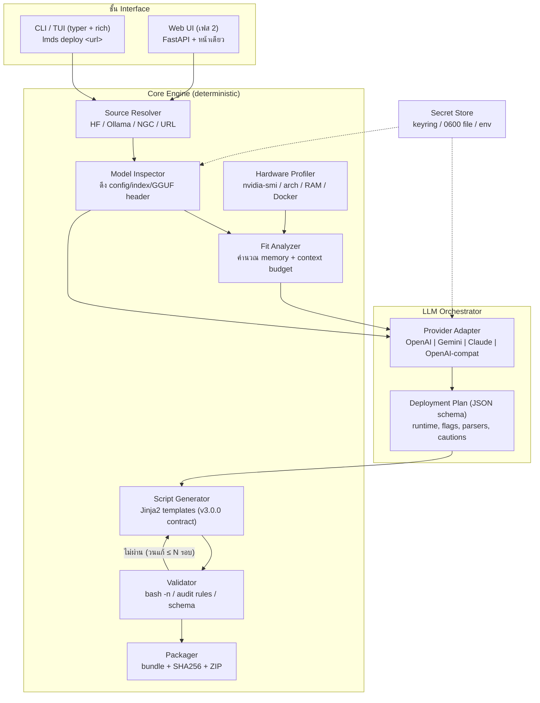

# PRD — Local Model Deploy Studio (LMDS)

| | |
|---|---|
| **เวอร์ชันเอกสาร** | 1.2 |
| **วันที่** | 21 กรกฎาคม 2026 (ปรับสถานะ FR ตามโค้ดจริง 6 สิงหาคม 2026) |
| **สถานะ** | อนุมัติทิศทางแล้ว — เริ่มเฟส 1 (CLI-first) |
| **Repository** | https://github.com/neronain/AutoDeployDGXProject |
| **แหล่งข้อมูลอ้างอิง** | `dgx-spark-model-deployer-team-pack-v3.0.0` (skill pack), [neronain/dgx-spark-all-controllers](https://github.com/neronain/dgx-spark-all-controllers), [neronain/Auto-Create-Script-for-DGX-Spark-loading-model](https://github.com/neronain/Auto-Create-Script-for-DGX-Spark-loading-model) |

---

## 1. บทสรุปผู้บริหาร (Executive Summary)

**Local Model Deploy Studio (LMDS)** คือโปรแกรมสำหรับรันบน Ubuntu ที่รับ **ลิงก์โมเดล**
(ปัจจุบันรองรับ Hugging Face และ Ollama registry; NGC/GitHub/URL ตรงอยู่เฟสถัดไป)
แล้วใช้ **LLM API ภายนอก** (OpenAI / Gemini / MiniMax / OpenAI-compatible endpoint — Claude
อยู่เฟส 2) เป็น "สมอง" ในการวิเคราะห์โมเดล เลือก runtime และ**สร้างชุดสคริปต์ deploy
(deployment bundle) ที่ผ่านการ validate แล้ว** สำหรับเครื่องเป้าหมาย ตั้งแต่ **NVIDIA DGX Spark**
(เดี่ยวหรือ stacked) ไปจนถึง **เครื่อง Ubuntu ทั่วไปที่ใช้ GPU RTX**

จุดแข็งของระบบคือไม่ได้เริ่มจากศูนย์ — เรามี **controller standard v3.0.0** ที่รันจริงแล้วกับโมเดลกว่า 12 ตัว (Gemma, GPT-OSS-120B, Llama 3.3 70B NVFP4, Nemotron, Qwen3, MiniMax ฯลฯ) พร้อม contract, template, quality gates และ audit tools ที่พิสูจน์แล้ว LMDS คือการยกกระบวนการนี้จาก "skill ที่ต้องรันผ่าน Claude Code" มาเป็น **โปรแกรม standalone ที่ลูกค้าใช้เองได้** โดยใช้ LLM API key ของลูกค้าเอง

### หลักการออกแบบสำคัญที่สุด

> **Deterministic core + LLM assist** — LLM ห้ามเขียน Bash อิสระ ทุกสคริปต์ที่ออกจากระบบต้อง render ผ่าน template ที่ผ่านการตรวจแล้ว โดย LLM มีหน้าที่แค่ (1) สรุปงานวิจัยโมเดล (2) ตัดสินใจเลือกค่าใน "Deployment Plan" ที่เป็น JSON schema ตายตัว ส่วนการคำนวณ (ขนาดโมเดล, memory fit, token budget) ทำด้วยโค้ดปกติ 100%

เหตุผล: SKILL.md ของ pack เดิมระบุชัดว่า "Do not copy a prior model's flags without re-verification" และปัญหาจริงที่เคยเจอ (Bash numeric underscore, pipefail SIGPIPE) ล้วนเป็น bug ชนิดที่ LLM สร้างซ้ำได้ง่าย — การบังคับผ่าน template + validator คือทางเดียวที่การันตีคุณภาพซ้ำได้

---

## 2. ปัญหาและโอกาส (Problem Statement)

1. การ deploy โมเดล open-weight บนเครื่อง local ต้องการความรู้เฉพาะทางสูง: เลือก runtime (vLLM / llama.cpp / SGLang / Ollama), ตรวจไฟล์พิเศษ (chat template, tool parser, mmproj), คำนวณ memory fit, pin revision — ผิดจุดเดียวคือรันไม่ขึ้นหรือได้ผลลัพธ์เพี้ยน
2. ความรู้เหล่านี้ตอนนี้อยู่ในรูป skill pack ที่ต้องใช้ผ่าน Claude Code/OpenClaw เท่านั้น — ลูกค้าทั่วไปที่มีเครื่อง RTX ใช้ไม่ได้
3. ลูกค้าแต่ละรายมี LLM API key ของตัวเอง (OpenAI, Gemini) อยู่แล้ว — ถ้าโปรแกรมใช้ key ของลูกค้าเป็นสมอง เราไม่ต้องแบกต้นทุน inference และลูกค้าควบคุมค่าใช้จ่ายเองได้

## 3. เป้าหมาย / ไม่ใช่เป้าหมาย

### เป้าหมาย (Goals)
- **G1** — รับลิงก์โมเดลจาก Hugging Face ✅ (repo / ลิงก์ไฟล์ GGUF ตรง) และ Ollama
  registry ✅ (resolve model blob → llama.cpp) แล้วสร้าง deployment bundle · Ollama Modelfile,
  NGC และ GitHub release ❌ เฟสถัดไป
- **G2** — รองรับ LLM provider อย่างน้อย: OpenAI ✅, Google Gemini ✅, MiniMax ✅ และ endpoint แบบ OpenAI-compatible ✅ (Ollama/vLLM — โมเดล local เป็นสมองเองได้โดยไม่ต้องมี key) · Anthropic Claude ❌ เฟส 2
- **G3** — ถาม HF token แบบ **optional** เฉพาะเมื่อจำเป็น (ตรวจ gated repo อัตโนมัติ) — ไม่ใส่ก็ดาวน์โหลด repo สาธารณะได้ตามปกติ
- **G4** — รองรับฮาร์ดแวร์ 3 กลุ่ม: DGX Spark เดี่ยว, DGX Spark stacked (2+ เครื่อง), และ Ubuntu + RTX (single/multi-GPU, x86_64)
- **G5** — ทุก bundle ที่ส่งออกผ่าน quality gates เดียวกับ v3.0.0 (`bash -n`, audit rules, SHA-256 manifest) โดยอัตโนมัติ
- **G6** — เก็บ secret (API key, HF token) อย่างปลอดภัย ไม่หลุดลงใน bundle หรือ log

### ไม่ใช่เป้าหมาย (Non-Goals) — เฟสแรก
- ไม่ทำ fine-tuning / quantization เอง (ชี้ไปยัง artifact ที่มีอยู่แล้วเท่านั้น)
- ไม่ทำ model marketplace หรือ hosting — เราสร้างสคริปต์ ลูกค้ารันเอง
- ไม่รองรับ Windows/macOS เป็น target ของ bundle (ตัวโปรแกรมรันบน Ubuntu เท่านั้น; การพัฒนาบน macOS ทำได้)
- ไม่ทำ Kubernetes/Helm ในเฟสแรก (อยู่ใน roadmap เฟส 3)

## 4. กลุ่มผู้ใช้ (Personas)

| Persona | คำอธิบาย | ความต้องการหลัก |
|---|---|---|
| **P1 — ทีม DGX Spark เดิม** | ทีมที่ใช้ controller v3.0.0 อยู่แล้ว | ได้เครื่องมือที่ output ตรง contract เดิม ใช้แทน workflow ผ่าน Claude Code ได้ |
| **P2 — ลูกค้า RTX server** | องค์กรที่มีเครื่อง Ubuntu + RTX 4090/5090/6000 Ada ฯลฯ | อยากรันโมเดลจากลิงก์ HF/Ollama โดยไม่ต้องรู้ vLLM/llama.cpp ลึก |
| **P3 — SI / ผู้วางระบบ** | ผู้รับงานติดตั้ง AI server ให้ลูกค้าหลายราย | ทำ bundle ซ้ำได้เร็ว มีเอกสาร README + checksum ส่งมอบลูกค้า |

## 5. User Stories หลัก

- **US1**: ผู้ใช้วางลิงก์ `https://huggingface.co/Qwen/Qwen3-32B` → ระบบวิเคราะห์ → ถามยืนยัน topology/runtime → สร้าง bundle + ZIP พร้อม README ภายในไม่กี่นาที
- **US2**: ผู้ใช้วางลิงก์โมเดล gated (เช่น Llama) → ระบบตรวจพบ 401/403 → ถาม HF token (ข้ามได้) → ถ้าใส่ ใช้ token ทั้งตอน inspect และฝังวิธีใช้ token ใน controller (ผ่าน env ไม่ hard-code)
- **US3** (✅ บางส่วน): ผู้ใช้วางลิงก์ `https://ollama.com/library/qwen3:32b` → ระบบ
  resolve manifest + pin model blob digest → ดึง GGUF ไปรันด้วย llama.cpp controller มาตรฐาน;
  output แบบ Ollama Modelfile/controller ยังไม่ทำ
- **US4**: ผู้ใช้รันบนเครื่อง RTX 4090 24GB → ระบบ profile ฮาร์ดแวร์ → เตือนว่าโมเดล FP16 70B ไม่พอ → เสนอ quant ที่พอ (เช่น GGUF Q4) พร้อมเหตุผลตัวเลข
- **US5** (บางส่วน — `lmds repair` ซ่อมไฟล์ที่ขาดได้แล้ว ส่วนวิเคราะห์ log ยังเป็นเฟส 2): ผู้ใช้เอา log ที่รันพังมาวาง → ระบบเข้าสู่ repair workflow → วิเคราะห์ → แก้ controller ทีละตัวแปร → ออก bundle เวอร์ชันใหม่
- **US6**: ผู้ใช้ตั้งค่า provider ครั้งเดียว (`lmds config set-provider openai`) → ใช้ได้ทุกครั้งโดย key เก็บใน OS keyring หรือไฟล์ `0600`

## 6. ขอบเขตฟังก์ชัน (Functional Requirements)

### FR-1 Input & Source Resolver
| ID | ข้อกำหนด | Priority |
|---|---|---|
| FR-1.1 | รับ URL/ID จาก Hugging Face (`org/model`, ลิงก์เต็ม, ลิงก์ไฟล์ GGUF ตรง) | P0 |
| FR-1.2 | รับลิงก์ Ollama (`ollama.com/library/<model>:<tag>`) — resolve ผ่าน registry manifest API, validate digest/size, อ่าน GGUF header ผ่าน HTTP Range ที่ตรวจช่วงตอบกลับ และ pin blob สำหรับ llama.cpp bundle — **✅ ทำแล้ว** (output แบบ Ollama Modelfile ยังไม่ทำ) | P1 |
| FR-1.3 | รับลิงก์ NVIDIA NGC และ GitHub release | P1 |
| FR-1.4 | ตรวจชนิด artifact อัตโนมัติ: safetensors (+index), GGUF (+mmproj), quant config (NVFP4/FP8/AWQ/GPTQ) | P0 |
| FR-1.5 | ตรวจ gated/private repo (HTTP 401/403) → ถาม HF token แบบ optional; ไม่ใส่ → แจ้งข้อจำกัดและดำเนินการเท่าที่ metadata สาธารณะเปิดให้ | P0 |
| FR-1.6 | ดึง metadata ขนาดเล็กเท่านั้นตอน inspect (config.json, tokenizer_config.json, index.json, chat_template ฯลฯ) — **ไม่**ดาวน์โหลด weight ตอนวิเคราะห์ | P0 |

### FR-1b Fleet หลายเครื่อง (เพิ่ม 2026-08-05)

| ID | ข้อกำหนด | Priority |
|---|---|---|
| FR-1b.1 | เครื่องหนึ่ง (hub) คุมเครื่องอื่น (node) ผ่าน SSH โดย **node ไม่ต้องรัน daemon** — hub เรียก `lmds agent info` บนเครื่องนั้นเพื่อขอสถานะเป็น JSON | P0 |
| FR-1b.2 | เพิ่มเครื่องด้วย ip/user/รหัสผ่าน **ครั้งเดียว** → ติดตั้ง SSH key ของ LMDS แล้วทิ้งรหัสผ่าน · **ทะเบียนต้องไม่มีฟิลด์รหัสผ่าน** | P0 |
| FR-1b.3 | ติดตั้ง/อัปเดต LMDS บน node จาก hub (`lmds node install`) — node ต้องมี `lmds` อยู่บนเครื่องเพราะ "agent" คือตัวคำสั่งเอง | P0 |
| FR-1b.4 | แสดงทรัพยากรสดทุกเครื่องจากที่เดียว: CPU, RAM/unified, VRAM, ดิสก์, ความเร็วสาย, **จำนวนโมเดลที่รัน** (llama.cpp รันหลายตัวพร้อมกันได้) | P0 |
| FR-1b.5 | **node ล่มต้องไม่ทำให้ hub หรือหน้าเว็บพัง** — แถวนั้นรายงานว่าติดต่อไม่ได้แล้วจบ | P0 |
| FR-1b.6 | ตรวจ fabric (ConnectX/RDMA/ความเร็วลิงก์) จาก `/sys` แล้วจับกลุ่มเครื่องที่ stacked ด้วยกันได้ — ต้องตรงทั้ง arch/profile/รุ่น GPU/จำนวน GPU และมีสาย ≥ 25G | P0 |
| FR-1b.7 | **cluster IP ต้องให้คนยืนยัน ระบบเสนอได้แต่ห้ามตั้งเอง** — เดาผิดแล้ว stacked จะค้างตอน NCCL init โดยไม่บอกสาเหตุ · ต้องเสนอจากวงที่ทุกเครื่องมีขาร่วมกัน และปฏิเสธ link-local | P0 |
| FR-1b.8 | เขียนค่าคลัสเตอร์ลง bundle (`cluster.env`) ได้ รวมถึง bundle ที่อยู่บนเครื่องอื่น | P1 |
| FR-1b.9 | คำสั่งที่สั่งข้ามเครื่องผ่านหน้าเว็บต้องจำกัดด้วย allowlist ฝั่ง server | P0 |

### FR-2 Hardware Profiler
| ID | ข้อกำหนด | Priority |
|---|---|---|
| FR-2.1 | ตรวจเครื่องเป้าหมายอัตโนมัติ: arch (ARM64/x86_64), GPU (nvidia-smi: รุ่น, VRAM, compute capability), RAM, disk ว่าง, Docker + NVIDIA container toolkit — ✅ | P0 |
| FR-2.2 | จำแนก hardware profile: `dgx-spark-single` (unified 128GB, SM121), `dgx-spark-stacked`, `rtx-single`, `rtx-multi-gpu`, `remote` (ป้อนสเปกมือ/ผ่าน SSH probe) | P0 |
| FR-2.3 | โหมด remote: สร้าง bundle ให้เครื่องอื่นโดยระบุสเปกเอง หรือ probe ผ่าน SSH | P1 |

### FR-3 Fit Analyzer (คำนวณล้วน — ไม่ใช้ LLM)
| ID | ข้อกำหนด | Priority |
|---|---|---|
| FR-3.1 | คำนวณ memory จาก: ขนาด weight จริง (จาก index/manifest) + KV cache ตาม context/concurrency + runtime overhead + CUDA buffers | P0 |
| FR-3.2 | แยกโมเดล unified memory (Spark) กับ VRAM-bound (RTX) — สูตรต่างกัน | P0 |
| FR-3.3 | เสนอ context เริ่มต้นที่ปลอดภัย + client token budget (input = context − max output − overhead ตามมาตรฐาน v3.0.0) | P0 |
| FR-3.4 | ถ้าไม่พอ: เสนอทางเลือกเรียงลำดับ (ลด context → quant ต่ำกว่า → multi-GPU/stacked → ปฏิเสธพร้อมเหตุผล) | P0 |

### FR-4 LLM Orchestrator ("สมอง")
| ID | ข้อกำหนด | Priority |
|---|---|---|
| FR-4.1 | Provider abstraction: OpenAI ✅, Gemini ✅, MiniMax ✅, OpenAI-compatible URL ✅ (ใช้โมเดล local เป็นสมองได้) — เลือก + สลับได้ · **Anthropic ❌ ยังไม่ทำ (เฟส 2)** | P0 |
| FR-4.2 | LLM ใช้ใน 3 งานเท่านั้น: (a) สรุป/สกัดข้อเท็จจริงจาก model card + configs (b) เลือกค่าใน **Deployment Plan (JSON schema ตายตัว, validate ด้วย schema ก่อนใช้)** (c) เขียนเนื้อหา README/คำอธิบาย | P0 |
| FR-4.3 | ทุก fact ที่ LLM สกัด ต้อง tag ที่มา: `verified` (จากไฟล์จริง) / `inferred` / `unverified` — ตาม operating principle ข้อ 4 ของ SKILL.md | P0 |
| FR-4.4 | มี fallback แบบ degraded: ถ้าไม่มี API key เลย ระบบยังทำงานได้กับโมเดลที่เข้า rule-based matrix ได้ (โมเดลตระกูลที่รู้จัก) โดยไม่มีคำอธิบาย/การวิเคราะห์เชิงลึก | P1 |
| FR-4.5 | แสดงประมาณการ token usage/ค่าใช้จ่ายต่อการ generate หนึ่งครั้ง — **❌ ยังไม่ทำ** | P2 |

### FR-5 Script Generator
| ID | ข้อกำหนด | Priority |
|---|---|---|
| FR-5.1 | Render ผ่าน template engine (Jinja2) จาก template ที่สืบทอด v3.0.0: `single-vllm` ✅, `stacked-vllm` ✅ (M8, 2026-07-24), `single-llamacpp` ✅ + เพิ่มใหม่ `single-rtx-vllm`, `single-rtx-llamacpp`, `ollama-controller`, `docker-compose` | P0 |
| FR-5.2 | ทุก controller ต้องมีครบตาม controller contract: config block บนสุด, คำสั่งขั้นต่ำ (`download/verify-files/start/stop/restart/status/logs/client-config/network-info`), flags `--context/--port/--bind/--advertise-ip/--interface/--client-input/--client-output` + env equivalents | P0 |
| FR-5.3 | บังคับกฎ portability v3.0.0: ห้าม numeric underscore literal, แยก bind/advertise/cluster address, pipefail-safe checks, pinned revision + runtime image digest | P0 |
| FR-5.4 | Bundle output ตาม delivery contract: `<slug>/` มี controller(.sh), `README.md`, `MODEL_PROFILE.yaml`, `SPECIAL_FILES.md` (เมื่อจำเป็น), `PACKAGE_SHA256SUMS`, + ZIP | P0 |
| FR-5.5 | สร้าง client-config ตัวอย่าง (OpenAI-compatible base URL, ตัวอย่าง curl/Python, ค่า token budget) | P0 |
| FR-5.6 | Optional: systemd unit (ไม่ enable อัตโนมัติ) — ✅ ทำแล้วผ่าน `lmds enable/disable` (รวม container ที่ไม่ได้มาจาก lmds) | P1 |

### FR-6 Validator & Quality Gates
| ID | ข้อกำหนด | Priority |
|---|---|---|
| FR-6.1 | Static: `bash -n`, shellcheck (ถ้ามี), audit rules จาก `audit-controllers.py` (underscore, pipefail, metadata), schema validation ของ MODEL_PROFILE.yaml | P0 |
| FR-6.2 | ถ้า static ไม่ผ่าน → วนกลับให้ generator แก้ (สูงสุด N รอบ) — ผู้ใช้ไม่มีวันได้ bundle ที่ไม่ผ่าน static | P0 |
| FR-6.3 | Runtime smoke test (optional, เมื่อรันบนเครื่องเป้าหมายจริง): GPU check ใน container, download, verify-files, start, `/health`, test-text, stop | P1 |
| FR-6.4 | รายงานสถานะชัดเจน: `static-validated` vs `hardware-validated` — ห้ามอ้าง hardware-tested ถ้าไม่ได้รันจริง | P0 |

### FR-7 Secret Management
| ID | ข้อกำหนด | Priority |
|---|---|---|
| FR-7.1 | เก็บ LLM API key + HF token ใน OS keyring (ถ้ามี) หรือ `~/.config/lmds/credentials` สิทธิ์ `0600`; รับผ่าน env var ได้ (`LMDS_OPENAI_API_KEY`, `HF_TOKEN` ฯลฯ) | P0 |
| FR-7.2 | ห้าม secret ปรากฏใน bundle, log, README, MODEL_PROFILE โดยเด็ดขาด — มี redaction filter ที่ output ทุกทาง + ทดสอบอัตโนมัติ | P0 |
| FR-7.3 | Controller ที่ generate อ้าง token ผ่าน env (`HF_TOKEN`) เท่านั้น ไม่ฝังค่า | P0 |

### FR-8 Repair Workflow
| ID | ข้อกำหนด | Priority |
|---|---|---|
| FR-8.1 | รับ log ความล้มเหลว (paste หรือไฟล์) + bundle เดิม → LLM จำแนกประเภทปัญหาตาม taxonomy ของ SKILL.md (host GPU / Docker GPU / image / kernel / model files / parser / memory / transport / client) | P1 |
| FR-8.2 | แก้ทีละตัวแปรเชิงสาเหตุ → validate ใหม่ → ออก bundle เวอร์ชันใหม่พร้อม CHANGELOG | P1 |

## 7. Non-Functional Requirements

| หมวด | ข้อกำหนด |
|---|---|
| **แพลตฟอร์ม** | Ubuntu 22.04 / 24.04, รองรับทั้ง ARM64 (DGX Spark GB10) และ x86_64 (RTX); Python 3.10+ |
| **การติดตั้ง** | `pipx install lmds` หรือ single-file installer script; ไม่บังคับ Docker สำหรับตัวโปรแกรม (แต่ bundle ที่ generate ใช้ Docker) |
| **Offline-friendly** | template + rule matrix + validator ทำงาน offline ได้; ต้อง online เฉพาะ inspect โมเดล + เรียก LLM |
| **ประสิทธิภาพ** | analyze + generate + validate จบใน < 3 นาที (ไม่รวมดาวน์โหลด weight) |
| **i18n** | UI ภาษาไทย + อังกฤษ (team profile เดิมตั้ง `language: th` อยู่แล้ว) |
| **Licensing** | แสดง license ของโมเดลและเตือนข้อจำกัด commercial use ใน README ทุกครั้ง |
| **Auditability** | เก็บ session log (prompt/response ของ LLM, การตัดสินใจ, ผล validation) ต่อ bundle — ใช้ debug และตรวจย้อนหลัง |

## 8. สถาปัตยกรรมระบบ



### 8.1 Flow หลัก (Happy Path)

1. **Input** — `lmds deploy https://huggingface.co/Qwen/Qwen3-32B` (หรือ interactive wizard)
2. **Resolve & Inspect** — ระบุ source type → ดึงไฟล์ metadata ขนาดเล็ก → ถ้าเจอ 401/403 ถาม HF token (ข้ามได้)
3. **Hardware Profile** — ตรวจเครื่องปัจจุบัน หรือรับ profile เป้าหมาย (`--target dgx-spark-single|rtx-single|...`)
4. **Fit Analysis** — คำนวณเป็นตัวเลขล้วน: โมเดลพอไหม, context สูงสุดที่ปลอดภัย, ทางเลือก quant
5. **LLM Research** — ส่ง (metadata + fit result + rule matrix) ให้ LLM → ได้ Deployment Plan JSON: runtime ที่เลือก + เหตุผล, image/version pin, tool parser, ไฟล์พิเศษ, ข้อควรระวัง — validate ด้วย JSON schema
6. **ยืนยันกับผู้ใช้** — แสดงสรุปแผน (runtime, topology, context, ข้อจำกัด) ให้กดยืนยัน/แก้ก่อน generate
7. **Generate** — render template + ค่าจาก plan → bundle ครบชุด
8. **Validate** — static gates ทั้งหมด; ไม่ผ่าน → วนแก้อัตโนมัติ
9. **Deliver** — bundle + ZIP + checksums + ขั้นตอน first-run + สถานะ validation ที่ตรงความจริง

### 8.2 Deployment Plan Schema (หัวใจของการคุม LLM)

```yaml
# สิ่งเดียวที่ LLM "ตัดสินใจ" ได้ — ทุก field มี enum/validation
plan_version: 1
model:
  id: Qwen/Qwen3-32B
  revision: <commit-sha>          # ต้อง pin
  artifact_type: safetensors|gguf
  license: {name, commercial_ok, notes}
facts:                            # ทุกข้อ tag ที่มา
  - {claim: "...", source_url: "...", confidence: verified|inferred|unverified}
runtime:
  engine: vllm|llamacpp|sglang|ollama
  image_or_build: {ref, digest_or_commit}
  rationale: "..."
topology: single|stacked|multi-gpu
serving:
  context_default: 65536
  gpu_memory_utilization: 0.85
  kv_cache_dtype: auto|fp8
  extra_flags: []                 # ผ่าน allowlist ต่อ engine เท่านั้น
features:
  tool_calling: {enabled, parser, template, parallel: false}
  reasoning: {enabled, parser}
  multimodal: {modalities: [], projector_files: []}
special_files: [...]
warnings: [...]
validation_notes: [...]
```

`extra_flags` ผ่าน **allowlist ต่อ engine** — flag แปลกใหม่ที่ LLM เสนอจะถูกแสดงให้ผู้ใช้อนุมัติก่อนเสมอ ไม่ใส่อัตโนมัติ

### 8.3 Hardware Matrix — ความต่าง DGX Spark vs RTX ที่ template ต้องรองรับ

| ประเด็น | DGX Spark | Ubuntu + RTX |
|---|---|---|
| สถาปัตยกรรม | ARM64 (GB10) | x86_64 |
| หน่วยความจำ | Unified ~128GB (แชร์ CPU/GPU) | VRAM แยก (8–48GB) + system RAM |
| CUDA arch | SM121 (`121a-real` สำหรับ llama.cpp build) | SM86/89/120 ตามรุ่น |
| Docker image | ต้องมี ARM64 manifest หรือ build local | image ปกติใช้ได้แทบทั้งหมด |
| Multi-node | ConnectX/RoCE + NCCL pins (stacked) | มัก single-node; multi-GPU ใช้ tensor parallel ในเครื่อง |
| สูตร fit | weights + KV + runtime ≤ unified − OS reserve | weights + KV + CUDA ctx ≤ VRAM; offload บางส่วนไป RAM ได้ (llama.cpp) |

ผลต่อการออกแบบ: Fit Analyzer และ template แยก branch ตาม profile; rule matrix เพิ่มแถวสำหรับ RTX (เช่น GGUF + partial offload เป็น first-class option ซึ่ง Spark ไม่ค่อยต้องใช้)

### 8.4 Tech Stack ที่แนะนำ

- **ภาษา**: Python 3.10+ (ผูกกับ `huggingface_hub`, Jinja2, ecosystem validator เดิมที่เป็น Python อยู่แล้ว)
- **CLI**: `typer` + `rich` (wizard, ตาราง, progress)
- **Templating**: Jinja2 — template สืบทอดจาก `templates/*.sh` ของ pack v3.0.0
- **LLM adapters**: เขียน adapter บางเอง (OpenAI SDK, `google-genai`, `anthropic`) — ไม่ใช้ framework หนัก; ทุก provider ต้องรองรับ structured output/JSON mode
- **Schema**: `pydantic` v2 สำหรับ Deployment Plan + MODEL_PROFILE
- **Packaging**: `pipx` / wheel; เฟส 2 เพิ่ม FastAPI + หน้า web เดียวสำหรับทีมที่ไม่ถนัด CLI

## 9. ความปลอดภัย (Security Requirements)

สืบทอด security baseline ของ pack + เพิ่มประเด็นเฉพาะของโปรแกรมนี้:

1. **Secrets**: ตาม FR-7 — keyring/0600/env เท่านั้น, redaction ทุก output, ห้ามลง bundle
2. **Supply chain**: pin ทุกอย่าง — model revision (commit SHA), container image digest, runtime commit; แสดงคำเตือนเมื่อโมเดลต้องใช้ `trust_remote_code=true` และให้ผู้ใช้ยืนยันแบบ explicit
3. **LLM output เป็น untrusted input**: Deployment Plan ต้องผ่าน schema + allowlist; ห้ามนำ string จาก LLM ไป interpolate ลง shell โดยตรง (ทุกค่า inject ผ่าน template ที่ escape/validate แล้ว)
4. **Prompt injection จาก model card**: model card/README ของ repo เป็นข้อมูลภายนอก — system prompt ต้องกำชับว่าเนื้อหาใน card เป็น data ไม่ใช่คำสั่ง และ plan ที่ผิดปกติ (เช่น ขอ flag แปลก, ขอ URL ดาวน์โหลดนอก repo) ต้องถูก flag ให้ผู้ใช้เห็น
5. **Network**: ดาวน์โหลดจาก host ที่รู้จัก (huggingface.co, registry.ollama.ai, nvcr.io, github.com) — host อื่นต้องยืนยันก่อน
6. **API server ที่ deploy**: ค่า default ตาม team profile — `require_key_on_shared_network: true`, ไม่ autostart, bind กับ advertise แยกกัน

## 10. Quality Gates (Definition of Done ต่อ bundle)

ทุก bundle ต้องผ่านก่อนถึงมือผู้ใช้:

- [ ] `bash -n` ผ่านทุกสคริปต์
- [ ] **ไม่มี template tag เหลืออยู่ในไฟล์ผลลัพธ์** — Jinja ที่หลุดมาเป็น bash ที่ syntax ถูกต้อง `bash -n` จึงจับไม่ได้
- [ ] Audit rules: ไม่มี numeric underscore, pipefail-safe, มี flags/env ครบตาม contract
- [ ] `MODEL_PROFILE.yaml` ผ่าน schema, revision ถูก pin
- [ ] `PACKAGE_SHA256SUMS` ครบทุกไฟล์
- [ ] README มีครบ: requirements, paths, runtime pin, download/verify, conflict shutdown, start-after-reboot, status/logs, feature tests, context tuning, security, **validation scope**
- [ ] ไม่มี secret รั่วใน bundle (automated scan)
- [ ] ระบุสถานะ `static-validated` หรือ `hardware-validated` ตรงความจริง

## 11. แผนการพัฒนา (Roadmap)

### เฟส 1 — MVP (แนะนำ ~6–8 สัปดาห์)
- CLI + HF source + hardware profiler (Spark single + RTX single)
- Provider: OpenAI + Gemini + OpenAI-compatible
- Template: single-vllm, single-llamacpp (Spark + RTX variants)
- Static validation ครบ, secret management, ZIP delivery
- **เกณฑ์สำเร็จ**: โมเดลอ้างอิง 5 ตัว (dense safetensors, GGUF, NVFP4, MoE, gated) ได้ bundle ที่รันจริงบนเครื่อง Spark และ RTX อย่างละ 1 เครื่อง

### เฟส 2
- Ollama Modelfile/controller + NGC source, stacked controller, repair workflow, Anthropic provider
- Web UI หน้าเดียว, runtime smoke test อัตโนมัติบนเครื่องเป้าหมาย, i18n ไทยเต็มรูป

### เฟส 3
- Multi-GPU RTX (tensor parallel), docker-compose/systemd hardened output, Kubernetes/Helm
- Bundle registry ภายในทีม (เก็บ/ค้น bundle เดิม), telemetry ต้นทุน LLM

## 12. ความเสี่ยงและการรับมือ

| ความเสี่ยง | ผลกระทบ | การรับมือ |
|---|---|---|
| LLM ให้ค่า config ผิด/มโน | bundle รันไม่ขึ้น | Deterministic core + schema + allowlist + วน static validation; ค่าที่คำนวณได้ไม่ให้ LLM ตัดสิน |
| Runtime ecosystem เปลี่ยนเร็ว (vLLM ออก breaking change) | template ล้าสมัย | pin image digest ใน template registry ที่อัปเดตแยกจากตัวโปรแกรม (data file, ไม่ hard-code) |
| ฮาร์ดแวร์ RTX หลากหลายมาก | fit ผิดพลาด | เริ่มจาก allowlist GPU รุ่นที่ทดสอบแล้ว + โหมด conservative (เผื่อ headroom สูง) สำหรับรุ่นนอก list |
| ลูกค้าไม่มี LLM key | ใช้โปรแกรมไม่ได้ | FR-4.4 degraded mode (rule-based สำหรับตระกูลโมเดลที่รู้จัก) |
| Prompt injection ผ่าน model card | สคริปต์อันตราย | ข้อ 9.3–9.4 + ทุก flag แปลกต้องผ่านการยืนยันของผู้ใช้ |
| Gated repo โดยไม่มี token | inspect ไม่ได้ | แจ้งชัด + ให้ทางเลือก: ใส่ token / เลือก mirror/quant สาธารณะ / ยกเลิก |

## 13. Decision Log และคำถามเปิด

### ตัดสินใจแล้ว

| วันที่ | การตัดสินใจ | รายละเอียด |
|---|---|---|
| 2026-07-21 | **เฟสแรกเป็น CLI ล้วน** | เจ้าของโปรเจกต์อนุมัติตามข้อเสนอ — Web UI และเฟสถัดไปจะทบทวนอีกครั้งเมื่อ CLI เสร็จ ≥98% หรือรันใช้งานจริงได้ |
| 2026-07-21 | **Repository** | พัฒนาใน https://github.com/neronain/AutoDeployDGXProject |
| 2026-07-21 | **แนวทางที่เหลือของเฟส 1** | ดำเนินตามข้อเสนอใน PRD นี้ (provider เริ่มที่ OpenAI + Gemini + OpenAI-compatible, template vLLM/llama.cpp ก่อน) |
| 2026-07-21 | **เครื่องทดสอบ RTX** | Ubuntu ทั้งหมด: RTX PRO 4000 Blackwell 24GB ×2 ใบ (multi-GPU) และ RTX 4070 Super 16GB แบบใบเดียว — ใช้เป็น GPU allowlist เริ่มต้น (`tested=true`) ร่วมกับ DGX Spark |
| 2026-07-24 | **Stacked (multi-node) generation** | เปิดใช้ใน CLI ผ่าน `--target dgx-spark-stacked` — template `stacked-vllm-controller.sh.j2` port จาก reference v8.2 (DeepSeek-V4-Flash 2×DGX Spark, hardware-validated 2026-07-22) แบบ generic driven-by-env · topology เป็นสมบัติของ target (harden บังคับเสมอ ไม่ให้ LLM เลือก) · gate `stacked-contract` กัน bundle single-node ปลอม · **ยังไม่เพิ่ม flag `--topology` แยก** (topology มาจาก target) — `--topology both` เลื่อนเป็นงานต่อยอด |

| 2026-08-05 | **Fleet หลายเครื่องคุยผ่าน SSH ไม่ใช้ daemon** | hub เรียก `lmds agent info` บน node ผ่าน SSH · node ไม่ต้องเปิดพอร์ตเพิ่มนอกจาก 22 ไม่มี agent ให้ค้างเป็นซอมบี้ และ node เวอร์ชันต่างกันยังคุยกันได้ · ข้อแลกเปลี่ยนคือ **ทุกเครื่องต้องติดตั้ง LMDS ก่อน** ซึ่งชดเชยด้วย `lmds node install` จาก hub |
| 2026-08-05 | **ไม่เก็บรหัสผ่านของ node เด็ดขาด** | ใช้ครั้งเดียวตอนติดตั้ง SSH key (`~/.config/lmds/id_lmds`) แล้วทิ้ง · `Node` dataclass ไม่มีฟิลด์รหัสผ่าน และมีเทสกันไม่ให้เผลอเพิ่มกลับเข้ามา · ผู้ใช้เสนอให้กรอก root ตอนแรก — เปลี่ยนเป็น user ในกลุ่ม `docker` เพราะ LMDS ไม่เคยต้องการ root ในการรันโมเดล |
| 2026-08-05 | **cluster IP ระบบเสนอได้ แต่คนต้องยืนยัน** | ตรวจเจอการ์ด 200G เป็นคนละเรื่องกับรู้ว่า NCCL คุยกันทาง IP ไหน · เครื่องจริงมี fabric หลายวงและพอร์ตที่ยังไม่ตั้งค่าจะได้ 169.254.x.x มาเอง · เดาผิด = ค้างตอน NCCL init แบบไล่สาเหตุยาก จึงเสนอเฉพาะวงที่ทุกเครื่องมีขาร่วมกัน และมี blocker `split-fabric`/`link-local` |
| 2026-08-05 | **stacked ใช้ `mp` backend ไม่ใช้ Ray** | ทดสอบ Llama 3.3 70B บน DGX Spark 2 เครื่องจริง — vLLM native multi-node (`--nnodes/--node-rank/--headless`) จับ NCCL ข้ามเครื่องผ่าน RoCE ได้ · ตัดสินใจ **ไม่** เพิ่ม Ray/tmux/`run_cluster.sh` เข้าระบบตามที่สคริปต์มือของผู้ใช้ทำ เพราะชิ้นส่วนน้อยกว่าและได้ผลเท่ากัน |
| 2026-08-05 | **image ตั้งต้นแยกตามเครื่องเป้าหมาย** | DGX Spark (GB10/SM121) ใช้ `nvcr.io/nvidia/vllm` ของ NGC · `vllm/vllm-openai` มี manifest arm64 แต่ไม่ได้ build kernel ให้ SM121 · โมเดลที่ต้องใช้ build เฉพาะ (เช่น DeepSeek V4) override ผ่าน `cluster.env` ได้ |
| 2026-08-05 | **static gate ไม่พอ ต้องรันจริง** | การรัน stacked ครั้งแรกบนฮาร์ดแวร์เจอบั๊ก 3 ตัวที่ gate ทั้ง 10 ด่านจับไม่ได้ เพราะทั้งหมดเป็น bash ที่ syntax ถูกต้อง (head container ไม่เคย start, Jinja หลุดเข้าไฟล์ผลลัพธ์, ล็อก image ใช้ร่วมทั้งเครื่อง) · เพิ่ม gate `template-rendered` และยึดหลักว่า **สถานะ hardware-validated ต้องมาจากการรันจริงเท่านั้น** |

### คำถามเปิด (ยังรอคำตอบ — ไม่ block เฟส 1)

1. **Ollama controller**: ลูกค้า RTX อยากได้ output แบบ "ติดตั้ง Ollama + Modelfile" (ง่ายสุด) หรือแบบ llama.cpp controller มาตรฐาน v3.0.0 (ควบคุมได้มากกว่า)? — เฟส 1 จะทำ llama.cpp path ก่อน และรองรับ Ollama link แบบ resolve-to-GGUF
2. **License โปรแกรม**: ขายลูกค้า (proprietary) หรือ open-source บางส่วน?
3. **เครื่องทดสอบ**: มีเครื่อง RTX รุ่นไหนให้ทดสอบ MVP บ้าง (เพื่อกำหนด GPU allowlist เริ่มต้น)?
4. **ชื่อผลิตภัณฑ์**: "Local Model Deploy Studio (LMDS)" เป็นชื่อชั่วคราว (ชื่อ repo คือ AutoDeployDGXProject) — ชื่อ CLI command ใช้ `lmds` ไปก่อน เปลี่ยนภายหลังได้

---

## ภาคผนวก ก — สรุปทรัพย์สินเดิมที่นำมาใช้ต่อ (Asset Reuse Map)

| ทรัพย์สินเดิม | ที่มา | ใช้ใน LMDS อย่างไร |
|---|---|---|
| Controller contract + portability rules | `references/controller-contract.md`, SKILL.md v3.0.0 | เป็น spec ของ template engine + validator โดยตรง |
| Templates 3 ตัว (single-vllm, stacked-vllm, single-llamacpp) | `templates/*.sh` | แปลงเป็น Jinja2 template ตั้งต้น + แตก variant RTX |
| Runtime decision matrix | `references/runtime-decision-matrix.md` | แปลงเป็น rule table ในโค้ด + ใส่ใน LLM system prompt |
| Quality gates + audit rules | `references/quality-gates.md`, `audit-controllers.py` | รวมเข้า Validator module |
| MODEL_PROFILE.yaml template | `templates/MODEL_PROFILE.yaml` | เป็น base ของ pydantic schema |
| Controllers จริง 12 ตัว | repo `dgx-spark-all-controllers` | ใช้เป็น regression fixtures: LMDS ต้อง generate เทียบเท่าได้ |
| Research workflow / special-files checklist | `references/*.md` | ฝังใน LLM prompt ของขั้น Research |
| Team profile | `config/team-profile.yaml` | กลายเป็น per-site config ของ LMDS (`~/.config/lmds/profile.yaml`) |
| Repair workflow | SKILL.md §Repair | เป็น spec ของ FR-8 |
